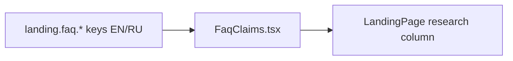

# FaqClaims.tsx — AI component doc

> AI-facing sidecar for `FaqClaims.tsx`. Created 2026-07-06, restyled
> 2026-07-07 (editorial rows), rebuilt the same day for Stage 2 (prose on the
> void). Keep this in sync with the code on every change.

## Purpose
The claims FAQ, restricted to the three honest topics the copy rules allow —
credits never expire (+ no subscription required), what a credit is, which
models are behind the product. v3 Stage 2: PROSE DIRECTLY ON THE VOID — no
cards, no hairline rows, no disclosure widgets.

## What it does (for an AI reader)
- Responsibilities: `SectionHeading` (`landing.faq.title`, amber spark icon) +
  `<ul>` of three plain Q&A prose blocks — white weight-400 `text-base` h3
  question with the `text-sm text-mist-dim max-w-prose` answer directly under
  it.
- Public API / exports: `FaqClaims` (no props).
- Inputs → Outputs: `ITEMS` const (`expire`/`credit`/`models`, doubling as
  i18n key segments `landing.faq.items.<id>.*`) → stacked prose Q&A.
- Side effects: none.

## Dependencies
- Imports / depends on: `react-i18next`, `./SectionHeading`.
- Used by: `LandingPage.tsx` (closing research-column section).

## Diagram

## Key decisions / gotchas
- Plain stacked Q&A instead of a disclosure/accordion — three short answers
  don't earn extra interaction cost (and stay findable with in-page search).
- The fourth approved claim («No subscription required») lives inside the
  `expire` answer — the FAQ must NOT grow topics beyond the approved claims.
- **Stage 2 intent**: the hairline `border-b` rows and the 12-col baseline
  grid were dropped — the brief says "FAQ as prose directly on the void (no
  cards)"; the white-question/dimmed-answer contrast alone carries hierarchy
  (questions stay weight 400 per the weight ceiling).
- `max-w-prose` keeps answers at a readable measure inside the 800px column.

## Commits
- f2fe5d7 2026-07-06 feat(web): landing with honest price comparison (EN/RU)
- 2f56573 2026-07-07 restyle(web): editorial landing + pricing
- 252ab38 2026-07-07 restyle(web): terminal design system — cosmic void tokens, jetbrains mono, specimen pills + docs
- (pending) restyle(web): terminal landing with ascii-sphere hero + pricing (prose on the void)
