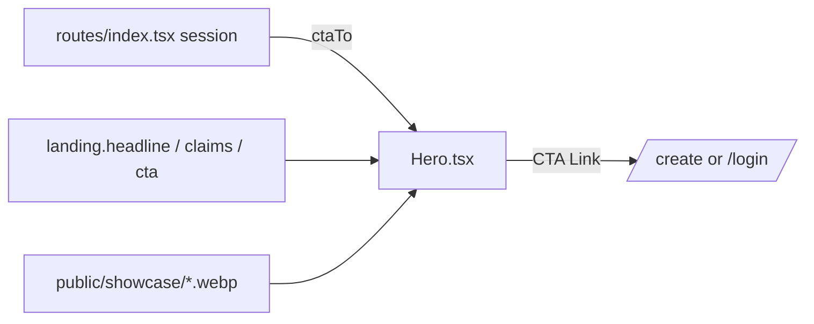

# Hero.tsx — AI component doc

> AI-facing sidecar for `Hero.tsx`. Created 2026-07-06. Keep this in sync with the code on every change.

## Purpose
Landing hero: the plan-mandated display headline (EN «Create images & video.
Pay pennies, not plans.» / RU «Создавай изображения и видео. Плати копейки, а
не подписки.»), the three approved claims, the primary CTA and a decorative
showcase strip.

## What it does (for an AI reader)
- Responsibilities: h1 display headline, one-line claims (`images from $0.01 ·
  5-second videos from $0.35 · credits never expire`), primary-lg CTA `Link`,
  and a 4-thumbnail gradient-placeholder strip from `public/showcase/*.webp`.
- Public API / exports: `Hero`, `HeroProps` (`ctaTo: '/create' | '/login'`).
- Inputs → Outputs: `ctaTo` (decided by the route from the session — the
  module never reads auth itself, avoiding a cross-module import) → hero JSX.
- Side effects: none (images are static assets, `loading="lazy"`).

## Dependencies
- Imports / depends on: `@tanstack/react-router` (`Link`), `react-i18next`.
- Used by: `LandingPage.tsx` (first section).

## Diagram

## Key decisions / gotchas
- Copy rules: ONLY the four approved claims exist anywhere on the landing (the
  fourth, "no subscription required", lives in the FAQ answer); tests assert
  the absence of "cheapest"/"cheaper than every…".
- The showcase strip is `aria-hidden` + `alt=""` — placeholders carry no
  information; swap in real product output later without an API change.
- Media wells use `bg-media` (the only allowed dark surface, design.md §2).

## Commits
- _pending: feat(web): landing with honest price comparison (EN/RU)_
