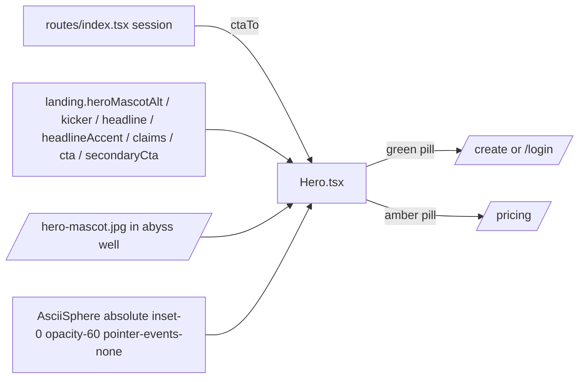

# Hero.tsx — AI component doc

> AI-facing sidecar for `Hero.tsx`. Created 2026-07-06, rebuilt 2026-07-07
> twice (stage-2 editorial, then the Stage 2 ascii-sphere terminal hero).
> Keep this in sync with the code on every change.

## Purpose
The v3 Stage 2 landing hero: a FULL-VIEWPORT (`min-h-svh`) stage with the
animated `AsciiSphere` canvas (dimmed to 60%) behind centered content — the
MASCOT figure, big mono wordmark, quiet kicker, whisper-weight mono display
headline (weight 400, ONE portal accent word), the approved claims line in
mist, and TWO specimen-pill CTAs (green "start creating" + amber "see
pricing"). The MASCOT is the hero now (owner brief 2026-07-24: media-first);
the sphere is faint atmosphere behind it.

## What it does (for an AI reader)
- Responsibilities: lead with the mascot figure (a `<figure>` recessed
  `bg-abyss` media well + white/10 hairline holding `/hero-mascot.jpg`, alt
  `landing.heroMascotAlt`, `fetchPriority="high"` for LCP, responsive
  `w-[clamp(11rem,26vw,18rem)]`), then center the brand plate (`openCreate·` —
  the landing masthead carries no wordmark, this is it), kicker
  (`landing.kicker`), h1
  headline with the locale-driven accent word (`landing.headlineAccent`)
  wrapped in an inline `<em class="text-portal not-italic">`, claims line
  (`images · videos · expire` joined with mid-dots, `text-mist`), and the CTA
  pair mirroring Button lg pill anatomy.
- Public API / exports: `Hero`, `HeroProps` (`ctaTo: '/create' | '/login'`).
- Inputs → Outputs: `ctaTo` (decided by the route from the session — the
  module never reads auth itself) → hero JSX.
- Side effects: none here; `AsciiSphere` self-manages its canvas loop.

## Dependencies
- Imports / depends on: `@tanstack/react-router` (`Link`), `react-i18next`,
  `shared/ui` (`AsciiSphere`).
- Static assets: `/hero-mascot.jpg` (public/, 900² web-optimized crop of the
  mascot key art) — the hero figure.
- Used by: `LandingPage.tsx` (first section, full-bleed — outside the 800px
  research column).

## Diagram

## Key decisions / gotchas
- **Accent-word split**: the headline stays ONE i18n string; the accent word is
  found via `indexOf` and wrapped inline, so (a) the h1 accessible name remains
  the verbatim headline (e2e asserts it exactly), and (b) `scripts/prerender.mjs`
  still finds the contiguous `"Pay pennies, not plans."` — the EN accent
  ("video") MUST live in the first sentence. RU accent is «копейки».
  A locale without a matching accent renders the headline whole (defensive).
- **Stage 2 changes**: full-viewport `min-h-svh` stage (svh so mobile URL bars
  never cut the CTAs); `AsciiSphere` is `absolute inset-0 pointer-events-none`
  (clicks/selection pass through to the copy); the secondary pricing link was
  PROMOTED from a portal text link to the AMBER specimen pill («Смотреть
  цены» / "See pricing") — the reference hero pairs two pills; claims moved
  from mist-dim to MIST (they are the product's facts, not chrome).
- Copy rules: ONLY the approved claims; tests assert the absence of
  "cheapest"/"cheaper than every…".
- CTA pills share `pillBaseClass` mirroring Button primary/ghost lg classes —
  links must not become buttons (navigation semantics), so the classes are
  mirrored, not the component reused.

## Update 2026-07-24 — mascot leads the hero (media-first)
- The mascot (`/hero-mascot.jpg`, the brand's new face) is now the hero's first,
  main figure — a recessed `bg-abyss` media well + white/10 hairline, the design
  system's plate treatment for artwork, sized `w-[clamp(11rem,26vw,18rem)]` so the
  CTAs stay near the fold. Alt via `landing.heroMascotAlt` (EN+RU), meaningful (not
  decorative) — `LandingPage.test.tsx` asserts an `img` with the accessible name.
- **Why**: the owner locked a real visual identity (mascot + "openCreate." wordmark)
  and asked to make the mascot the landing centerpiece — the earlier "text IS the
  hero, never a photo" note is superseded by this brief (media-first, high-contrast).
- The `AsciiSphere` stays but drops to `opacity-60` — faint atmosphere behind the
  mascot, not a competing subject. Section order, headline, claims, CTAs and their
  destinations are unchanged, so the existing LandingPage tests still hold.

## Commits
- f2fe5d7 2026-07-06 feat(web): landing with honest price comparison (EN/RU)
- 2f56573 2026-07-07 restyle(web): editorial landing + pricing
- 252ab38 2026-07-07 restyle(web): terminal design system — cosmic void tokens, jetbrains mono, specimen pills + docs
- 3ce8dbf 2026-07-07 restyle(web): terminal landing with ascii-sphere hero + pricing
