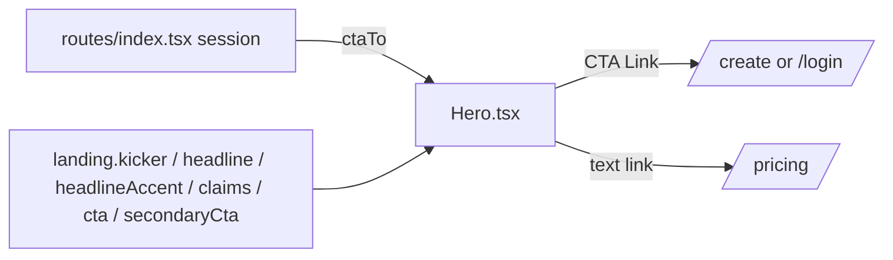

# Hero.tsx — AI component doc

> AI-facing sidecar for `Hero.tsx`. Created 2026-07-06, rebuilt 2026-07-07
> (stage-2 editorial redesign). Keep this in sync with the code on every change.

## Purpose
Editorial landing hero: uppercase micro-label kicker, giant left-aligned
Fraunces headline (`clamp(3.5rem,8vw,7rem)`, leading 0.98) with exactly ONE
vermillion italic word, the three approved claims in one line, and the solid-ink
CTA pill + secondary text link to `/pricing` (brief §Page-by-page → Landing).

## What it does (for an AI reader)
- Responsibilities: kicker (`landing.kicker`, uppercase via CSS), h1 headline
  with the locale-driven accent word (`landing.headlineAccent`) wrapped in an
  inline `<em class="text-vermillion italic">`, claims line (`images · videos ·
  expire` joined with mid-dots), ink-pill CTA (mirrors Button primary/lg,
  hover → vermillion) and the underlined "See the price index" text link.
- Public API / exports: `Hero`, `HeroProps` (`ctaTo: '/create' | '/login'`).
- Inputs → Outputs: `ctaTo` (decided by the route from the session — the module
  never reads auth itself) → hero JSX.
- Side effects: none. The v1 placeholder thumbnail strip was REMOVED — showcase
  art now lives in `ShowcaseSpread.tsx`.

## Dependencies
- Imports / depends on: `@tanstack/react-router` (`Link`), `react-i18next`.
- Used by: `LandingPage.tsx` (first section).

## Diagram

## Key decisions / gotchas
- **Accent-word split**: the headline stays ONE i18n string; the accent word is
  found via `indexOf` and wrapped inline, so (a) the h1 accessible name remains
  the verbatim headline (e2e asserts it exactly — inline `<em>` does not change
  browser accname), and (b) `scripts/prerender.mjs` still finds the contiguous
  `"Pay pennies, not plans."` — which is why the EN accent ("video") MUST live
  in the first sentence. RU accent is «копейки» (no prerender constraint).
  A locale without a matching accent renders the headline whole (defensive).
- Copy rules: ONLY the approved claims; tests assert the absence of
  "cheapest"/"cheaper than every…".
- Secondary link text stays ink; only the underline flips to vermillion on
  hover (small vermillion text is banned by design.md §2).

## Commits
- f2fe5d7 2026-07-06 feat(web): landing with honest price comparison (EN/RU)
- 2f56573 2026-07-07 restyle(web): editorial landing + pricing
