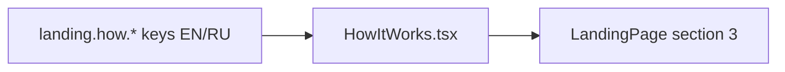

# HowItWorks.tsx — AI component doc

> AI-facing sidecar for `HowItWorks.tsx`. Created 2026-07-06. Keep this in sync with the code on every change.

## Purpose
Landing section 3: the three-step product story (prompt → model → result) as
an ordered list of white cards.

## What it does (for an AI reader)
- Responsibilities: h2 (`landing.how.title`) + `<ol>` of three step cards —
  visible ordinal badge (aria-hidden; the `ol` itself conveys order), h3 title,
  one-line description.
- Public API / exports: `HowItWorks` (no props).
- Inputs → Outputs: `STEPS` const (`prompt`/`model`/`result`, which double as
  i18n key segments `landing.how.steps.<id>.*`) → 1-col mobile / 3-col desktop
  grid.
- Side effects: none.

## Dependencies
- Imports / depends on: `react-i18next`.
- Used by: `LandingPage.tsx` (section 3).

## Diagram

## Key decisions / gotchas
- `<ol>` (not `<ul>`/divs) because the steps ARE a sequence — semantics first.
- Step keys are stable string ids (never array index) — list-key rule.

## Commits
- f2fe5d7 2026-07-06 feat(web): landing with honest price comparison (EN/RU)
