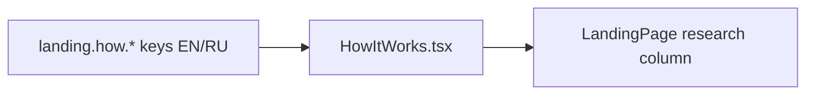

# HowItWorks.tsx — AI component doc

> AI-facing sidecar for `HowItWorks.tsx`. Created 2026-07-06, restyled
> 2026-07-07 (editorial rows), rebuilt the same day for Stage 2 (plain prose
> rows). Keep this in sync with the code on every change.

## Purpose
The three-step product story (prompt → model → result) as PLAIN MONO PROSE
rows for the ~800px research column (v3 Stage 2): small portal ordinals in a
2.5rem margin column, white body-size step titles, dimmed descriptions — no
hairline grid, no display numerals.

## What it does (for an AI reader)
- Responsibilities: `SectionHeading` (`landing.how.title`, amber spark icon) +
  `<ol>` of three prose rows on a `grid-cols-[2.5rem_1fr]` template: portal
  mono `0N` ordinal (aria-hidden; the `ol` itself conveys order), white
  weight-400 `text-base` h3 title, `text-sm text-mist-dim` description in the
  second column.
- Public API / exports: `HowItWorks` (no props).
- Inputs → Outputs: `STEPS` const (`prompt`/`model`/`result`, which double as
  i18n key segments `landing.how.steps.<id>.*`) → stacked prose rows.
- Side effects: none.

## Dependencies
- Imports / depends on: `react-i18next`, `./SectionHeading`.
- Used by: `LandingPage.tsx` (research-column section after PriceTable).

## Diagram

## Key decisions / gotchas
- `<ol>` (not `<ul>`/divs) because the steps ARE a sequence — semantics first.
- Step keys are stable string ids (never array index) — list-key rule; the
  visible `0N` ordinal derives from position, which is rendering, not a key.
- **Stage 2 intent**: the v2/Stage-1 hairline 12-col rows with 3xl ordinals
  were loud for the narrow column — "plain mono prose rows" per the brief:
  hierarchy now comes ONLY from color (portal ordinal, white title, dimmed
  body); h3 stays for the document outline, ordinal stays OUTSIDE the h3 so
  the heading's accessible name is the verbatim i18n title.
- Portal is the prose accent (triad glows are reserved for status/actions);
  the weight-500 ceiling applies to numerals too.

## Commits
- f2fe5d7 2026-07-06 feat(web): landing with honest price comparison (EN/RU)
- 2f56573 2026-07-07 restyle(web): editorial landing + pricing
- 252ab38 2026-07-07 restyle(web): terminal design system — cosmic void tokens, jetbrains mono, specimen pills + docs
- 3ce8dbf 2026-07-07 restyle(web): terminal landing with ascii-sphere hero + pricing (plain prose rows)
