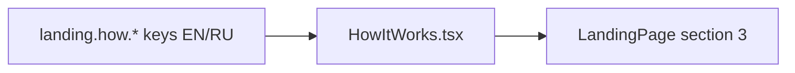

# HowItWorks.tsx — AI component doc

> AI-facing sidecar for `HowItWorks.tsx`. Created 2026-07-06, restyled
> 2026-07-07 (stage-2 editorial rows). Keep this in sync with the code on every change.

## Purpose
Landing section 03: the three-step product story (prompt → model → result) as
numbered editorial rows — serif 01/02/03 ordinals over hairline rules (brief:
"How-it-works as numbered 01/02/03 rows with hairlines").

## What it does (for an AI reader)
- Responsibilities: `SectionHeading` (ordinal 03 + `landing.how.title`) +
  `<ol>` of three hairline rows: vermillion serif ordinal (aria-hidden; the
  `ol` itself conveys order), serif h3 title, ink-soft description on a
  12-col baseline grid (2/4/6 spans).
- Public API / exports: `HowItWorks` (no props).
- Inputs → Outputs: `STEPS` const (`prompt`/`model`/`result`, which double as
  i18n key segments `landing.how.steps.<id>.*`) → stacked rows (grid collapses
  to one column on mobile).
- Side effects: none.

## Dependencies
- Imports / depends on: `react-i18next`, `./SectionHeading`.
- Used by: `LandingPage.tsx` (section 03).

## Diagram

## Key decisions / gotchas
- `<ol>` (not `<ul>`/divs) because the steps ARE a sequence — semantics first.
- Step keys are stable string ids (never array index) — list-key rule; the
  visible `0N` ordinal derives from position, which is rendering, not a key.
- Row ordinals are vermillion serif at 2xl/3xl — the sanctioned ≥18px/bold
  accent use (design.md §2); rows have `border-b` only because SectionHeading
  already draws the opening rule.

## Commits
- f2fe5d7 2026-07-06 feat(web): landing with honest price comparison (EN/RU)
- 2f56573 2026-07-07 restyle(web): editorial landing + pricing
