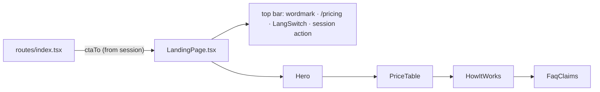

# LandingPage.tsx — AI component doc

> AI-facing sidecar for `LandingPage.tsx`. Created 2026-07-06. Keep this in sync with the code on every change.

## Purpose
The whole standalone landing screen (`/`): slim top bar (wordmark, pricing
link, EN/RU LangSwitch, session-aware action) + the four sections in reading
order — Hero, PriceTable, HowItWorks, FaqClaims.

## What it does (for an AI reader)
- Responsibilities: assemble the marketing page; own its top bar (the landing
  is standalone — NOT inside AppShell, design.md §9).
- Public API / exports: `LandingPage`, `LandingPageProps`
  (`ctaTo: '/create' | '/login'`).
- Inputs → Outputs: `ctaTo` (route decides from the session) → page JSX; the
  top-bar action mirrors the hero CTA destination (Sign in vs Create label).
- Side effects: none.

## Dependencies
- Imports / depends on: `@tanstack/react-router` (`Link`), `react-i18next`,
  `shared/ui` (`LangSwitch`), sibling components `Hero`, `PriceTable`,
  `HowItWorks`, `FaqClaims`.
- Used by: `routes/index.tsx` (the only consumer, via `modules/Landing`).

## Diagram

## Key decisions / gotchas
- `ctaTo` is a PROP, not a session read — `modules/Landing` must not import
  `modules/Auth` (cross-module imports are banned); the route composes them.
- The LangSwitch in this top bar is the control the e2e RU-hero scenario
  (plan Task 21) clicks — do not remove it when restyling.
- `/pricing` is a plain `<a>` until Task 20 creates the route (typed Link
  union); swapped to `Link` in the Task 20 commit.

## Commits
- _pending: feat(web): landing with honest price comparison (EN/RU)_
