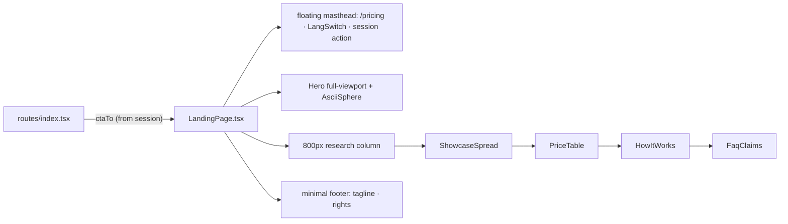

# LandingPage.tsx — AI component doc

> AI-facing sidecar for `LandingPage.tsx`. Created 2026-07-06, rebuilt
> 2026-07-07 twice (stage-2 editorial, then Stage 2 ascii-sphere terminal).
> Keep this in sync with the code on every change.

## Purpose
The whole standalone landing screen (`/`) in the v3 Stage 2 terminal voice: a
FLOATING transparent masthead (nav only) over the full-viewport ascii-sphere
Hero, then the narrow ~800px RESEARCH COLUMN — specimen showcase grid, the
mono terminal price index, plain how-it-works prose rows, FAQ prose — closed
by a minimal one-line footer. Everything sits on the flat void.

## What it does (for an AI reader)
- Responsibilities: assemble the marketing page; own its masthead and footer
  (the landing is standalone — NOT inside AppShell, design.md §10). The hero
  is full-bleed; the rest lives in `max-w-[50rem]` with ≥96px section gaps on
  desktop (`md:gap-28`).
- Public API / exports: `LandingPage`, `LandingPageProps`
  (`ctaTo: '/create' | '/login'`).
- Inputs → Outputs: `ctaTo` (route decides from the session) → page JSX; the
  masthead action mirrors the hero CTA destination (Sign in vs Create label).
- Side effects: none.

## Dependencies
- Imports / depends on: `@tanstack/react-router` (`Link`), `react-i18next`,
  `shared/ui` (`LangSwitch`), sibling components `Hero`, `ShowcaseSpread`,
  `PriceTable`, `HowItWorks`, `FaqClaims`.
- Used by: `routes/index.tsx` (the only consumer, via `modules/Landing`).

## Diagram

## Key decisions / gotchas
- `ctaTo` is a PROP, not a session read — `modules/Landing` must not import
  `modules/Auth` (cross-module imports are banned); the route composes them.
- The LangSwitch in this masthead is the control the e2e RU-hero scenario
  clicks — do not remove it when restyling.
- **Stage 2 masthead change**: the bar went TRANSPARENT + `absolute` (not
  sticky steel) and DROPPED the wordmark — the big centered wordmark in the
  hero is the brand plate now; a second top-left wordmark would double it.
  Nav links keep the AppShell's quiet lowercase mono voice so '/' and the app
  still read as one product. AppShell itself keeps its sticky steel bar.
- The research column (`max-w-[50rem]` ≈ 800px) is landing/prose law only
  (design.md §4); app screens keep the wider grid.
- Section h2 order is behavior: `LandingPage.test.tsx` asserts
  `['Selected works', 'Honest price comparison', 'How it works',
  'Fair questions']`; the footer is queried as `contentinfo` and must keep
  the `© 2026 openCreate` rights line.

## Commits
- f2fe5d7 2026-07-06 feat(web): landing with honest price comparison (EN/RU)
- a04eac7 2026-07-06 feat(web): pricing page with per-model credit table (pricing anchor → typed Link)
- 2f56573 2026-07-07 restyle(web): editorial landing + pricing
- 252ab38 2026-07-07 restyle(web): terminal design system — cosmic void tokens, jetbrains mono, specimen pills + docs
- (pending) restyle(web): terminal landing with ascii-sphere hero + pricing
