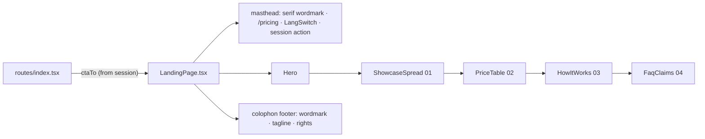

# LandingPage.tsx — AI component doc

> AI-facing sidecar for `LandingPage.tsx`. Created 2026-07-06, rebuilt
> 2026-07-07 (stage-2 editorial redesign). Keep this in sync with the code on every change.

## Purpose
The whole standalone landing screen (`/`): hairline masthead (serif wordmark
"openCreate·", uppercase nav micro-labels, EN/RU LangSwitch, session-aware
action) + the editorial reading order — Hero, Selected works spread, The index,
numbered How-it-works rows, FAQ rows — closed by a colophon footer.

## What it does (for an AI reader)
- Responsibilities: assemble the marketing page; own its masthead and footer
  (the landing is standalone — NOT inside AppShell, design.md §10). Sections
  sit ≥96px apart on desktop (`md:gap-28`, brief QA #3).
- Public API / exports: `LandingPage`, `LandingPageProps`
  (`ctaTo: '/create' | '/login'`).
- Inputs → Outputs: `ctaTo` (route decides from the session) → page JSX; the
  masthead action mirrors the hero CTA destination (Sign in vs Create label).
- Side effects: none.

## Dependencies
- Imports / depends on: `@tanstack/react-router` (`Link`), `react-i18next`,
  `shared/ui` (`LangSwitch`), sibling components `Hero`, `ShowcaseSpread`,
  `PriceTable`, `HowItWorks`, `FaqClaims`.
- Used by: `routes/index.tsx` (the only consumer, via `modules/Landing`).

## Diagram

## Key decisions / gotchas
- `ctaTo` is a PROP, not a session read — `modules/Landing` must not import
  `modules/Auth` (cross-module imports are banned); the route composes them.
- The LangSwitch in this masthead is the control the e2e RU-hero scenario
  (plan Task 21) clicks — do not remove it when restyling.
- Masthead mirrors the AppShell top bar (same serif wordmark with the
  aria-hidden vermillion dot, same uppercase micro-label voice) so '/' and the
  app read as one brand (brief QA #6).
- Section h2 order is behavior: `LandingPage.test.tsx` asserts
  `['Selected works', 'Honest price comparison', 'How it works',
  'Fair questions']`; the footer is queried as `contentinfo`.

## Commits
- f2fe5d7 2026-07-06 feat(web): landing with honest price comparison (EN/RU)
- a04eac7 2026-07-06 feat(web): pricing page with per-model credit table (pricing anchor → typed Link)
- 2f56573 2026-07-07 restyle(web): editorial landing + pricing
