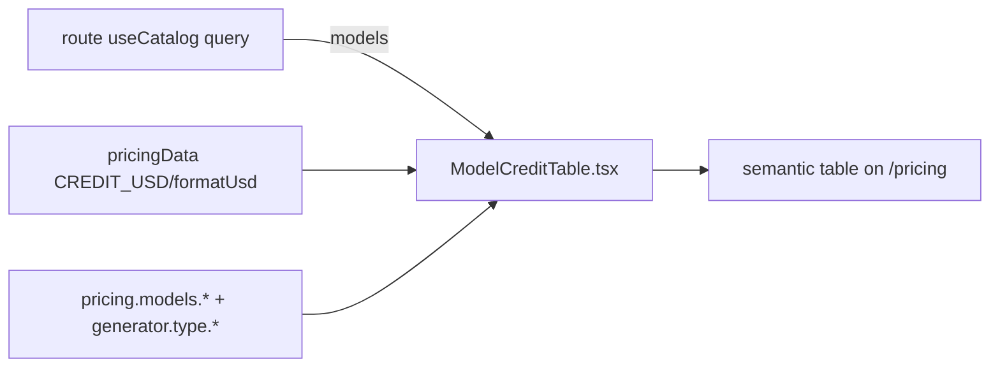

# ModelCreditTable.tsx — AI component doc

> AI-facing sidecar for `ModelCreditTable.tsx`. Created 2026-07-06. Keep this in sync with the code on every change.

## Purpose
Full per-model credit table for the `/pricing` page: every catalog model with
its honest provider label, localized type, credits (flat / per duration) and
the ≈ USD conversion at $0.01/credit. v3 restyled it to the terminal "index"
treatment — white/10 hairline rules on the void, mono weight-400 credit
numerals in SPECIMEN GREEN (`text-glow-green`, Stage 2 — our credit prices are
the "go/us" numbers, same glow the comparison table gives OUR column), quiet
lowercase mono headers (the weight/uppercase laws).

## What it does (for an AI reader)
- Responsibilities: render `models` as a labelled `<table>` (aria-label =
  `pricing.models.title`) with `border-white/10` hairline rows (no card), quiet
  mono caption column headers, and mono weight-400 credit numerals; format
  credits (`1 · per image`, `5s — 35 · 8s — 56`) and USD (`$0.01`, `from $0.35`
  via cheapest duration).
- Public API / exports: `ModelCreditTable`, `ModelCreditTableProps`
  (`models: CatalogModel[]`).
- Inputs → Outputs: catalog models (fetched by the ROUTE — this component is
  purely presentational) → semantic table rows keyed by `model.id`.
- Side effects: none.

## Dependencies
- Imports / depends on: `i18next` (`TFunction` type), `react-i18next`,
  `@opencreate/contracts` (`CatalogModel`), `../model/pricingData`
  (`CREDIT_USD`, `formatUsd`).
- Used by: `routes/_shell.pricing.tsx` (data state of its catalog query).

## Diagram

## Key decisions / gotchas
- The catalog query (and its 4 UI states) lives in the route on purpose — the
  Landing module stays free of Generator's data hooks; this keeps the module
  boundary clean while both reuse the SAME `['catalog']` cache entry.
- `creditsByDuration[String(d)]` can be `undefined` under
  `noUncheckedIndexedAccess` — renders an em-dash, never "undefined".
- Type column reuses `generator.type.*` keys instead of duplicating copy.
- The table draws its own bottom hairline (`border-b` on `<table>`) because its
  rows only carry `border-t` — the index needs a closing rule.

## Commits
- a04eac7 2026-07-06 feat(web): pricing page with per-model credit table
- 2f56573 2026-07-07 restyle(web): editorial landing + pricing
- 252ab38 2026-07-07 restyle(web): terminal design system — cosmic void tokens, jetbrains mono, specimen pills + docs
- 3ce8dbf 2026-07-07 restyle(web): terminal landing with ascii-sphere hero + pricing (glow-green credit numerals)
