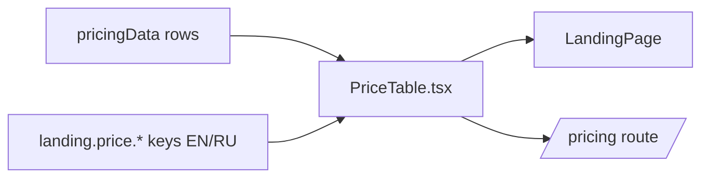

# PriceTable.tsx — AI component doc

> AI-facing sidecar for `PriceTable.tsx`. Created 2026-07-06. Keep this in sync with the code on every change.

## Purpose
Semantic comparison table for the honest-pricing claim: our price per use case
vs ONE named competitor item per row, with the verification date as the
table's accessible name.

## What it does (for an AI reader)
- Responsibilities: render `PRICE_COMPARISON_ROWS` as a `<table>` inside a
  white card — columns "What you get" / "openCreate" (accent) / "Elsewhere";
  our cells washed `bg-accent-soft` with `text-accent` only (design.md §7).
- Public API / exports: `PriceTable` (no props — data comes from the module's
  own `pricingData`).
- Inputs → Outputs: static rows + i18n keys `landing.price.*` → section with
  h2 + captioned table; prices printed via `formatUsd`.
- Side effects: none.

## Dependencies
- Imports / depends on: `react-i18next`, `../model/pricingData`.
- Used by: `LandingPage.tsx` (section 2) and `routes/_shell.pricing.tsx`
  (Task 20 reuses it above the per-model credit table).

## Diagram

## Key decisions / gotchas
- The `<caption>` (verification date) is deliberately the table's accessible
  name — screen readers hear the honesty marker before any number; the test
  queries `getByRole('table', { name: /verified july 2026/i })`.
- No blanket "cheapest" wording anywhere — copy rules allow only the four
  approved claims plus per-row comparisons.
- `min-w-[36rem]` + `overflow-x-auto` keeps three readable columns on phones.

## Commits
- f2fe5d7 2026-07-06 feat(web): landing with honest price comparison (EN/RU)
