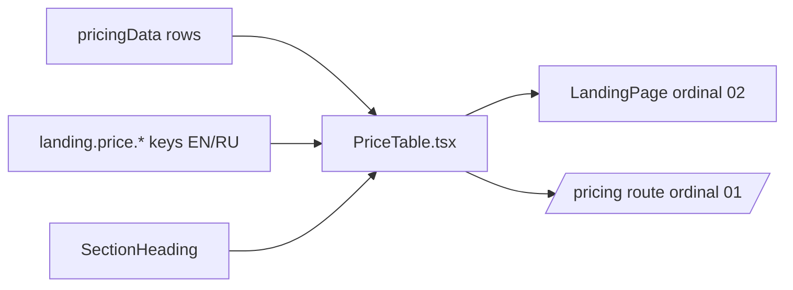

# PriceTable.tsx — AI component doc

> AI-facing sidecar for `PriceTable.tsx`. Created 2026-07-06, restyled 2026-07-07
> (stage-2 "The index" treatment). Keep this in sync with the code on every change.

## Purpose
"The index" — the honest price comparison as a v3 terminal index table: white/10
hairline rules on the void (no card), mono weight-400 numerals, OUR column in
glow-green and the verification date as a footnote. Our price per use case vs
ONE named competitor item per row.

## What it does (for an AI reader)
- Responsibilities: `SectionHeading` (kicker "The index" + h2 "Honest price
  comparison") and the `PRICE_COMPARISON_ROWS` `<table>`: quiet mono caption
  column headers (ours in portal blue), `border-white/10` row hairlines, mono
  weight-400 price numerals (ours glow-green 2xl/3xl, competitor same size in
  white), model/competitor notes in mist-dim, `caption-bottom` footnote.
- Public API / exports: `PriceTable`, `PriceTableProps`
  (`ordinal?: string`, default `'01'` — landing passes `'02'`; data comes from
  the module's own `pricingData`).
- Inputs → Outputs: static rows + i18n keys `landing.price.*` → section with
  SectionHeading + captioned table; prices printed via `formatUsd`.
- Side effects: none.

## Dependencies
- Imports / depends on: `react-i18next`, `../model/pricingData`,
  `./SectionHeading`.
- Used by: `LandingPage.tsx` (section 02) and `routes/_shell.pricing.tsx`
  (opening 01 section above the per-model credit table).

## Diagram

## Key decisions / gotchas
- The `<caption>` (verification date) is deliberately the table's accessible
  name — `caption-bottom` only moves it visually to the footnote position; the
  test still queries `getByRole('table', { name: /verified july 2026/i })`.
- v3 restyle intent: glow-green carries OUR numerals (green = "go/us/cheaper"
  in the triad — succeeded-status family), the column HEADER uses portal blue
  (the prose accent) so no status glow ships at caption size; competitor
  numerals are plain white — the comparison stays honest and even, tilted only
  by color in our favor. All numerals dropped to weight 400 (the weight-500
  ceiling law). Small model notes stay mist-dim.
- No blanket "cheapest" wording anywhere — copy rules allow only the four
  approved claims plus per-row comparisons.
- `min-w-[36rem]` + `overflow-x-auto` keeps three readable columns on phones
  without horizontal page scroll (brief QA #5).

## Commits
- f2fe5d7 2026-07-06 feat(web): landing with honest price comparison (EN/RU)
- 2f56573 2026-07-07 restyle(web): editorial landing + pricing
- 252ab38 2026-07-07 restyle(web): terminal design system — cosmic void tokens, jetbrains mono, specimen pills + docs
