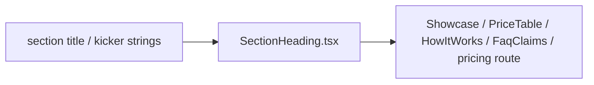

# SectionHeading.tsx — AI component doc

> AI-facing sidecar for `SectionHeading.tsx`. Created 2026-07-07 (stage-2 editorial
> landing/pricing rebuild). Keep this in sync with the code on every change.

## Purpose
The one editorial section header used by every landing/pricing section: ghost
serif ordinal (01/02/…) + optional uppercase micro-label kicker + serif `<h2>`
title over the standard hairline rule — the "magazine section opener" of the
Light Editorial design (design.md §4, §11).

## What it does (for an AI reader)
- Responsibilities: render the decorative ordinal (`aria-hidden`), the optional
  kicker (uppercase via CSS only) and the section `<h2>`; close with the
  `border-ink/15` hairline.
- Public API / exports / props / endpoints: `SectionHeading`,
  `SectionHeadingProps` (`ordinal: string`, `title: string`, `kicker?: string`).
- Inputs → Outputs: localized strings in → static header JSX out. No state.
- Side effects (I/O, network, state): none.

## Dependencies
- Imports / depends on: none (pure presentational).
- Used by: `ShowcaseSpread.tsx`, `PriceTable.tsx`, `HowItWorks.tsx`,
  `FaqClaims.tsx`, `routes/_shell.pricing.tsx`.

## Diagram

## Key decisions / gotchas
- The ordinal and kicker sit OUTSIDE the `<h2>`: `LandingPage.test.tsx` asserts
  the exact `textContent` of every level-2 heading, and `scripts/prerender.mjs`
  greps `Honest price comparison` — the h2 text must stay the verbatim i18n title.
- Uppercase is CSS `text-transform` so DOM/i18n text stays sentence case (§3).
- Exported through `modules/Landing` index because the /pricing route reuses it
  for its "Credits per model" section (same index treatment, brief §Page-by-page).

## Commits
- 2f56573 2026-07-07 restyle(web): editorial landing + pricing
