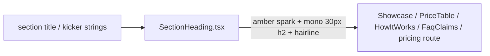

# SectionHeading.tsx — AI component doc

> AI-facing sidecar for `SectionHeading.tsx`. Created 2026-07-07; rebuilt the
> same day for Stage 2 (ascii-sphere landing). Keep this in sync with the code
> on every change.

## Purpose
The one section header used by every landing/pricing section, in the v3 Stage 2
terminal voice: a small AMBER section icon (four-point spark, decorative) +
optional quiet lowercase mono kicker + mono weight-400 30px `<h2>` title over
the standard white/10 hairline rule (design.md v3 §3-4).

## What it does (for an AI reader)
- Responsibilities: render the optional kicker (`text-xs text-mist-dim`), the
  decorative amber spark (`aria-hidden` inline SVG, `fill-current
  text-glow-amber`, size-4) and the section `<h2>` (`text-3xl font-normal
  text-white`); close with the `border-white/10` hairline.
- Public API / exports / props / endpoints: `SectionHeading`,
  `SectionHeadingProps` (`title: string`, `kicker?: string`).
- Inputs → Outputs: localized strings in → static header JSX out. No state.
- Side effects (I/O, network, state): none.

## Dependencies
- Imports / depends on: none (pure presentational).
- Used by: `ShowcaseSpread.tsx`, `PriceTable.tsx`, `HowItWorks.tsx`,
  `FaqClaims.tsx`, `routes/_shell.pricing.tsx`.

## Diagram

## Key decisions / gotchas
- **Stage 2 dropped the `ordinal` prop** (v2/Stage-1 ghost 01/02 numerals): the
  narrow ~800px research column marks sections with the amber icon per the
  reference ("amber section-icon + mono 30px heading"). All callers updated in
  the same change.
- The icon and kicker sit OUTSIDE the `<h2>`: `LandingPage.test.tsx` asserts
  the exact `textContent` of every level-2 heading, and `scripts/prerender.mjs`
  greps `Honest price comparison` — the h2 text must stay the verbatim i18n title.
- The spark is inline SVG in `currentColor` (never an OS emoji — closed triad
  law); amber = the triad's explore/browse tint, the sanctioned icon accent.
- The h2 obeys the heading law (mono 30px weight 400, no uppercase, no `md:`
  upscaling — hierarchy comes from white-vs-mist color and spacing).
- Exported through `modules/Landing` index because the /pricing route reuses it
  for its "Credits per model" section (same terminal treatment).

## Commits
- 2f56573 2026-07-07 restyle(web): editorial landing + pricing
- 252ab38 2026-07-07 restyle(web): terminal design system — cosmic void tokens, jetbrains mono, specimen pills + docs
- (pending) restyle(web): terminal landing with ascii-sphere hero + pricing (ordinal → amber spark icon)
