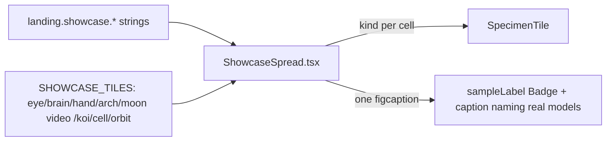

# ShowcaseSpread.tsx — AI component doc

> AI-facing sidecar for `ShowcaseSpread.tsx`. Created 2026-07-07 (editorial
> spread), rebuilt 2026-07-07 for Stage 2 (specimen grid). Keep this in sync
> with the code on every change.

## Purpose
"Selected works" as the v3 Stage 2 SPECIMEN GRID: eight blue-violet duotone
`SpecimenTile` plates in a square 4-col grid (2-col mobile), 8px gap + radius +
white/10 fog border — replacing the v2 asymmetric magazine spread of
ShowcasePoster figures. Chrome is minimal: one small mono caption UNDER the
grid instead of per-tile figure captions.

## What it does (for an AI reader)
- Responsibilities: render the `SectionHeading` (kicker + "Selected works"),
  ONE `<figure>` wrapping the 4×2 tile grid, the amber `video · 5s` chip on
  exactly one tile (the moon), and ONE `<figcaption>` carrying the honest
  labeling: the `landing.showcase.sampleLabel` Badge chip + the
  `landing.showcase.caption` line that names the REAL catalog models
  (Flash/FLUX schnell, Studio/FLUX dev, Cinema/Wan 2.7).
- Public API / exports: `ShowcaseSpread` (no props).
- Inputs → Outputs: i18n strings + the module-level `SHOWCASE_TILES` reading
  order (kind + isVideo) → static showcase JSX. No state, no data fetching.
- Side effects: none.

## Dependencies
- Imports / depends on: `react-i18next`, `shared/ui` (`Badge`, `SpecimenTile`,
  `SpecimenKind`), `./SectionHeading`.
- Used by: `LandingPage.tsx` (first section of the 800px research column).

## Diagram

## Key decisions / gotchas
- **Stage 2 replaced the v2 spread**: 6 asymmetric poster figures with
  per-figure `fig. 0N` captions → 8 square specimen tiles + ONE caption under
  the grid (the reference's "minimal chrome" rule). The old
  `landing.showcase.figure`/`items.*` keys remain in the locale files
  (i18n keys stay intact) but are no longer rendered.
- **Honesty markers survive the chrome diet**: the `sampleLabel` chip and the
  real model names moved INTO the single caption (`landing.showcase.caption`,
  new key in BOTH locales); exactly one tile stays video-marked
  (`landing.showcase.videoMarker`). Tests assert all three.
- The grid geometry is the reference verbatim: `gap-2` (8px), `rounded-lg`
  (8px), `border-white/10` fog border, `aspect-square`, `grid-cols-2
  md:grid-cols-4`. The v2 hover print-lift tilt was retired with the spread.
- The play triangle in the video chip is decorative `currentColor` SVG — the
  localized text carries the meaning (never an OS emoji). Tiles are
  `aria-hidden` inside SpecimenTile; screen readers hear only the caption.

## Commits
- 2f56573 2026-07-07 restyle(web): editorial landing + pricing
- 252ab38 2026-07-07 restyle(web): terminal design system — cosmic void tokens, jetbrains mono, specimen pills + docs
- (pending) restyle(web): terminal landing with ascii-sphere hero + pricing (specimen grid)
