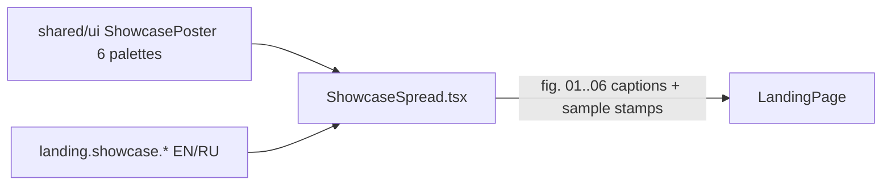

# ShowcaseSpread.tsx — AI component doc

> AI-facing sidecar for `ShowcaseSpread.tsx`. Created 2026-07-07 (stage-2 editorial
> landing rebuild). Keep this in sync with the code on every change.

## Purpose
The landing's "Selected works" magazine spread: six poster-grade `ShowcasePoster`
art cards in an asymmetric 12-col grid with honest editorial figure captions —
the section that replaces the v1 gradient-placeholder strip the product owner
rejected (brief §Showcase art, design.md §5).

## What it does (for an AI reader)
- Responsibilities: section header (`SectionHeading` 01 + "sample styles"
  kicker), 12-col spread (spans 7+5 / 4-tall-9:16+4+4 / full-width 21:9),
  per-card `<figure>` with slice-cropped poster, hover print-lift
  (≤1deg tilt + 1.5% scale, `motion-safe` only), and `<figcaption>`:
  `fig. 0N — “title” · Model (provider)` + neutral "sample style" `Badge` stamp.
  Exactly ONE card (sea) carries the vermillion `video · 5s` stamp overlay with
  a decorative play glyph.
- Public API / exports: `ShowcaseSpread` (no props).
- Inputs → Outputs: i18n strings (`landing.showcase.*`) + static
  `SHOWCASE_ITEMS` art-direction data → section JSX. No state, no data fetching.
- Side effects: none.

## Dependencies
- Imports / depends on: `react-i18next`, `shared/ui` (`Badge`, `ShowcasePoster`,
  `ShowcasePalette`), `./SectionHeading`.
- Used by: `LandingPage.tsx` (second block, between Hero and PriceTable).

## Diagram

## Key decisions / gotchas
- Honesty rules: every caption carries the localized "sample style" stamp and a
  REAL catalog model (Flash = FLUX schnell, Studio = FLUX dev, Cinema = Wan 2.7)
  — we never imply the posters are user generations. Model names are proper
  nouns and deliberately not translated.
- The video marker is the Badge-accent stamp treatment plus a `bg-cream/90`
  backing (a bare outline stamp would drown on dark art) — recorded in
  design.md §12.
- fig numbers come from reading-order position (`index + 1`, padStart 2) but
  keys stay the palette ids — index-as-key is still banned.
- The art is `aria-hidden` (inside ShowcasePoster); screen readers hear only
  the honest caption. Tests: `ShowcaseSpread.test.tsx` (6 figures, 1 video
  marker, distinct palettes, honest model labels).

## Commits
- 2f56573 2026-07-07 restyle(web): editorial landing + pricing
