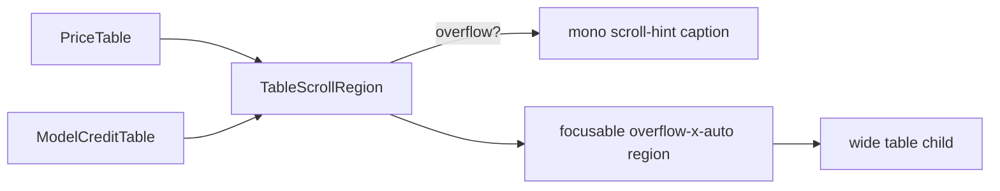

# TableScrollRegion.tsx — AI component doc

> AI-facing sidecar for `TableScrollRegion.tsx`. Created 2026-07-07. Keep this in sync with the code on every change.

## Purpose
The no-gradient horizontal-scroll affordance for the wide "index" tables
(v4 QA round 2): on narrow screens the tables clip mid-column inside an
`overflow-x-auto` region with no cue that they scroll. An edge fade would need
a CSS gradient (banned by the owner rule), so this wrapper shows a quiet mono
"scroll →" hint instead — only while there is really overflow.

## What it does (for an AI reader)
- Responsibilities: wrap a wide table in a keyboard-focusable scroll region;
  measure `scrollWidth > clientWidth` (initially + via `ResizeObserver` on the
  region and its first child, falling back to a window `resize` listener where
  the API is missing, e.g. jsdom); render the localized `common.scrollHint`
  caption (aria-hidden, `text-xs text-mist-dim`, right-aligned) only when the
  content overflows.
- Public API / exports / props: `TableScrollRegion`, `TableScrollRegionProps`
  — `label: string` (accessible name of the region, usually the table title),
  `children: ReactNode` (the table).
- Inputs → Outputs: label + table → `
` with an optional hint `
` above it.
- Side effects: none beyond the observer/listener (cleaned up on unmount).

## Dependencies
- Imports / depends on: `react` (`useEffect/useRef/useState`), `react-i18next`
  (`common.scrollHint` in BOTH en.json and ru.json).
- Used by: `PriceTable.tsx` (landing + /pricing) and `ModelCreditTable.tsx`
  (/pricing) — module-internal, not exported from `modules/Landing/index.ts`.

## Diagram

## Key decisions / gotchas
- Hint visibility is DYNAMIC (measured), not breakpoint-guessed: a `md:hidden`
  static hint would lie between ~600–768px where the 36rem tables already fit.
- The hint is `aria-hidden` — screen-reader users get the labelled, focusable
  region itself; announcing a decorative arrow would be noise.
- `tabIndex={0}` + `role="region"` + `aria-label` make the overflow area
  keyboard-scrollable (a11y: scrollable regions must be focusable).
- Focus style follows the design-system rule: portal ring, no removed outline.
- jsdom has no ResizeObserver and no layout: tests shadow
  `HTMLElement.prototype.scrollWidth/clientWidth` and rely on the resize-
  listener fallback branch.

## Commits
- 70fb5cc 2026-07-07 restyle(web): v4 qa round 2 (component introduced — no-gradient scroll affordance + keyboard-focusable region)
