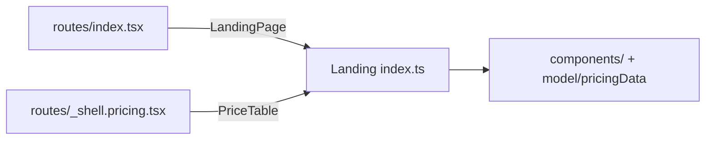

# index.ts — AI component doc

> AI-facing sidecar for `modules/Landing/index.ts`. Created 2026-07-06. Keep this in sync with the code on every change.

## Purpose
Public API of the Landing module — routes import ONLY from `'modules/Landing'`;
internal files (`components/`, `model/`) are private.

## What it does (for an AI reader)
- Responsibilities: re-export the module surface; no logic.
- Public API / exports: `LandingPage` (+`LandingPageProps`), `PriceTable`,
  `ModelCreditTable` (+`ModelCreditTableProps`).
- Inputs → Outputs: `import { LandingPage, PriceTable, ModelCreditTable } from 'modules/Landing'`.
- Side effects: none.

## Dependencies
- Imports / depends on: `./components/LandingPage`, `./components/PriceTable`.
- Used by: `routes/index.tsx` (LandingPage), `routes/_shell.pricing.tsx`
  (PriceTable + ModelCreditTable from Task 20 on).

## Diagram

## Key decisions / gotchas
- `PriceTable` is deliberately public: the /pricing route reuses the exact
  same verified comparison card — one honesty surface, one source of truth.
- `Hero`, `HowItWorks`, `FaqClaims`, `pricingData` stay private — pages
  compose `LandingPage`, never individual sections.
- `ModelCreditTable` went public in Task 20: the /pricing route owns the
  catalog query and passes `models` in — presentation stays in the module.

## Commits
- f2fe5d7 2026-07-06 feat(web): landing with honest price comparison (EN/RU)
- a04eac7 2026-07-06 feat(web): pricing page with per-model credit table (adds `ModelCreditTable`)
