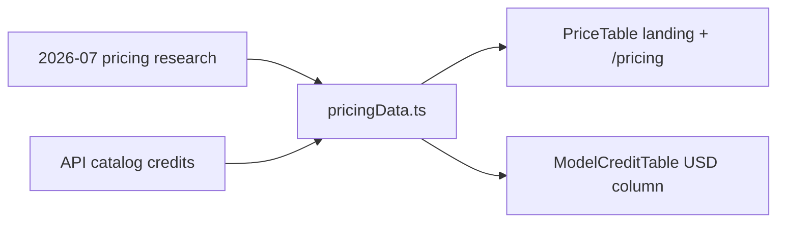

# pricingData.ts — AI component doc

> AI-facing sidecar for `pricingData.ts`. Created 2026-07-06. Keep this in sync with the code on every change.

## Purpose
Single config for the honest price comparison shown on the landing and the
pricing page: our credit prices (catalog credits × $0.01) vs three verified
competitor reference points from the 2026-07 research.

## What it does (for an AI reader)
- Responsibilities: hold `PRICE_COMPARISON_ROWS` (image vs Midjourney $0.05,
  5s video vs Higgsfield Seedance $0.83 Ultra-plan rate, 5s cinema video vs
  Runway Gen-4 $1.15) with a mandatory `verifiedAt: 'YYYY-MM'` on every row;
  expose `CREDIT_USD` (0.01) and `formatUsd`.
- Public API / exports: `CREDIT_USD`, `PriceComparisonRowId`,
  `PriceComparisonRow`, `PRICE_COMPARISON_ROWS`, `formatUsd`.
- Inputs → Outputs: static data → typed rows; `ourPriceUsd` is derived once
  (`ourCredits × CREDIT_USD`) so no UI re-implements the conversion.
- Side effects: none (pure data + pure formatter).

## Dependencies
- Imports / depends on: nothing (pure module).
- Used by: `components/PriceTable.tsx`, `components/ModelCreditTable.tsx`
  (USD column), tests in `PriceTable.test.tsx`.

## Diagram

## Key decisions / gotchas
- Row ids double as i18n key segments (`landing.price.rows.<id>.*`) — copy
  lives in the locale files, this file holds only numbers and brand nouns.
- Competitor names are proper nouns and never translated.
- Honesty contract (tested): every row MUST have `verifiedAt` matching
  `YYYY-MM`; no blanket "cheaper than everything" row may exist.
- Credits are hardcoded copies of the API catalog values (1 / 35 / 55) — the
  landing must render without a network call; the /pricing per-model table
  uses the LIVE catalog instead.

## Commits
- _pending: feat(web): landing with honest price comparison (EN/RU)_
