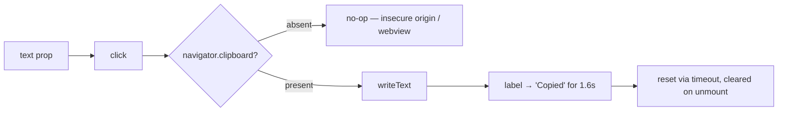

# CopyButton.tsx — AI component doc

> AI-facing sidecar for `CopyButton.tsx`. Created 2026-07-12. Keep this in sync with the code on every change.

## Purpose

Copy-to-clipboard pill with a short "copied" acknowledgement. The owner asked for
prompts you can copy; a copy button that gives no feedback reads as a dead button.

## What it does (for an AI reader)

- Responsibilities: write `text` to the clipboard, flip the label to "Copied" for
  ~1.6s, and clear its own timer on unmount.
- Public API / props: `{ text: string }`.
- Inputs → Outputs: a string → the system clipboard + a transient label change.
- Side effects: `navigator.clipboard.writeText`, one `setTimeout`.

## Dependencies

- Imports: `react` (`useEffect`, `useRef`, `useState`), `react-i18next`,
  `shared/ui` (`Button`, ghost/amber = secondary action).
- Used by: `SoulPreview` (the live composed prompt), `PromptLibrary` (each
  ready-made character).

## Diagram

## Key decisions / gotchas

- `navigator.clipboard` is undefined on insecure origins and in some embedded
  webviews — guarded, so the button degrades to a no-op instead of crashing.
- The ack timer is cleared on unmount: a library card can scroll away, and a modal
  can close, mid-ack.

## Commits

- _no commit yet_
