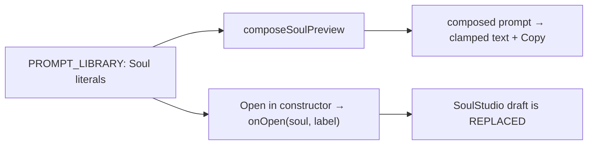

# PromptLibrary.tsx — AI component doc

> AI-facing sidecar for `PromptLibrary.tsx`. Created 2026-07-12. Keep this in sync with the code on every change.

## Purpose

The ready-made characters. Each `PROMPT_LIBRARY` entry is a Soul LITERAL, so the
card can offer both affordances: Copy (the composed text the owner asked for) and
"Open in constructor" — the second one is free precisely because the structure was
never thrown away.

## What it does (for an AI reader)

- Responsibilities: list every `PROMPT_LIBRARY` entry with its composed prompt
  (clamped to 3 lines), a `CopyButton`, and an open-in-constructor action.
- Public API / props: `{ onOpen: (soul: Soul, name: string) => void }`.
- Inputs → Outputs: the static contract library → cards + an `onOpen` callback that
  hands the whole soul back.
- Side effects: none (the clipboard write lives in `CopyButton`).

## Dependencies

- Imports: `react-i18next`, `@opencreate/contracts` (`PROMPT_LIBRARY`),
  `shared/ui` (`Button`, `Card`), `../model/soulPresentation`, sibling `CopyButton`.
- Used by: `SoulStudio`.
- Tested by: `PromptLibrary.test.tsx`.

## Diagram

## Key decisions / gotchas

- The text is RECOMPOSED from the contract tables, never stored: a fragment edit in
  contracts updates every card here without touching this file.
- Entry labels are contract data (already Russian), like the option tables.
- There is NO endpoint for the library — it ships in the bundle (ADR).

## Commits

- _no commit yet_
