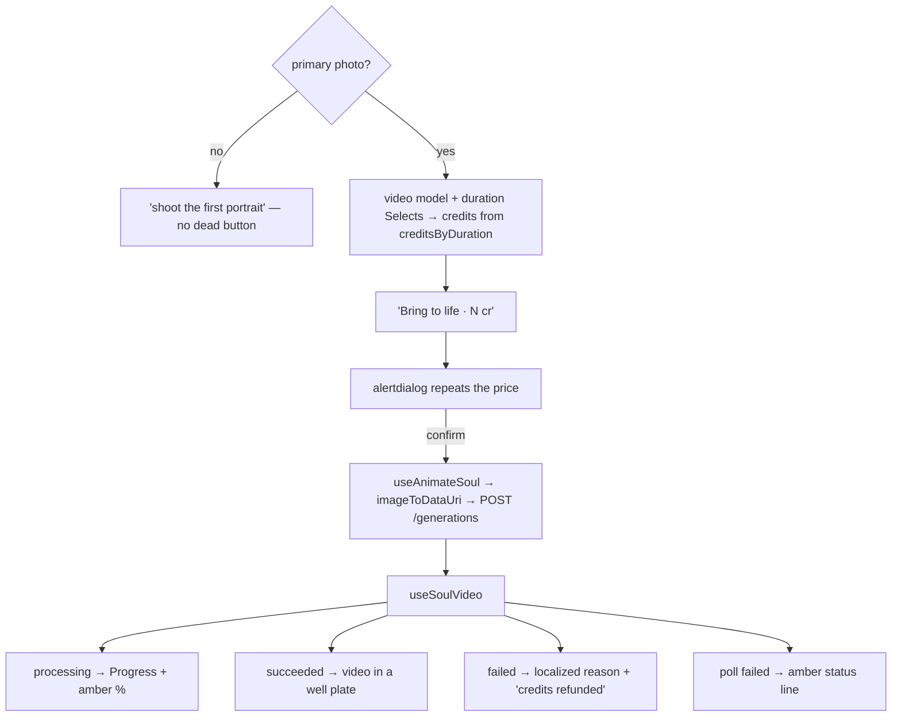

# SoulAnimate.tsx — AI component doc

> AI-facing sidecar for `SoulAnimate.tsx`. Created 2026-07-12. Keep this in sync with the code on every change.

## Purpose

"Оживить" — the primary portrait becomes the first frame of a video. Explicit,
priced (35–140 credits), confirmed, and never automatic: the owner rejected
auto-generating a video on create for exactly that reason (ADR, alternative F).

## What it does (for an AI reader)

- Responsibilities: pick a video model + duration from the catalog; show the price;
  take an editable action prompt (seeded from the character's derived description);
  confirm; POST the generation with the portrait as `inputImage`; then poll and
  render the clip's four states.
- Public API / props: `{ entity: Entity, models: CatalogModel[] }`.
- Inputs → Outputs: entity + catalog → `POST /api/generations` → a polled clip.
- Side effects: `useAnimateSoul` (charges credits; prepends to `['generations']`,
  invalidates `['me']`), `useSoulVideo` (polls `['generation', id]` every 4s).

## Dependencies

- Imports: `react`, `react-i18next`, `@opencreate/contracts` (types),
  `shared/libs/apiClient`, `shared/libs/errorCopy`, `shared/ui` (`Badge`, `Button`,
  `Card`, `Modal`, `Progress`, `Select`, `Skeleton`), `../model/soulApi`.
- Used by: `SoulCard`.

## Diagram

## Key decisions / gotchas

- A PLAIN generation: no new endpoint, no new money path. The generation service
  already owns charge, refund, poll and the NSFW gate; a second copy of any of those
  is a bug we would only find in the ledger.
- The style travels as STRUCTURE (`promptPreset: { styleId }`) so its NEGATIVE
  survives. The reference-sheet framing is deliberately NOT sent: that is how you
  photograph a character, not how you animate one.
- The model/duration selection is DERIVED from the catalog each render, not synced
  in an effect: the catalog can land after the first render, and an effect that
  "fixes up" state on arrival leaves the picker one render behind its data.
- The clip is session-local (`videoId` in state). A video is an ordinary generation
  and lives in `/library`; nothing on the entity stores it.
- A failed video is a REFUNDED video — saying so is the difference between a bug and
  a bad roll of the dice.

## Commits

- _no commit yet_
