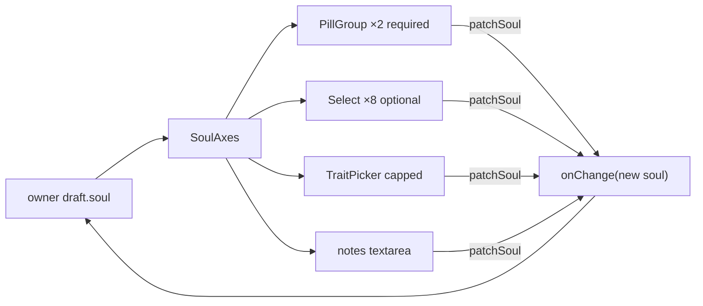

# SoulAxes.tsx — AI component doc

> AI-facing sidecar for `SoulAxes.tsx`. Created 2026-07-21. Keep this in sync with the code on every change.

## Purpose

The shared, controlled BODY of the character builder: the two required axis
pills, the eight optional axis dropdowns, the capped trait chips and the notes
escape hatch. Extracted from `SoulConstructor` so the studio's right Builder
panel and the soul-card edit modal render the SAME axes and cannot drift apart.

## What it does (for an AI reader)

- Responsibilities: render every character axis; patch the parent's `soul` on any
  change; enforce the trait cap through `toggleTrait`. It owns NO state and NO
  name/submit — those belong to whichever surface frames it.
- Public API / exports: `SoulAxes`, `SoulAxesProps` (`soul`, `onChange(soul)`).
- Inputs → Outputs: a `Soul` + an axis interaction → a new `Soul` via `onChange`.
- Side effects: none (pure controlled component).

## Dependencies

- Imports: `shared/ui` (`PillGroup`, `Select`); `model/soulOptions` (option
  builders + `ANY`/`optionalValue`); `model/soulDraft` (`toggleTrait`);
  `./TraitPicker`; `@opencreate/contracts` types.
- Used by: `components/SoulConstructor.tsx` (edit modal), `components/SoulBuilder.tsx`
  (studio right panel).

## Diagram

## Key decisions / gotchas
- The style `PillGroup` is typed `BuiltinStyleId` (ADR style-studio, 2026-07-31) — a soul's style axis
  stays the seven builtins even though the wire `StyleId` opened to a string.

- NAME-LESS and stateless on purpose: two owners frame the name/submit
  differently (composer dock vs edit modal), so the axes alone are shared.
- Labels are contract DATA (already Russian, like `STYLE_PRESETS`) — the
  documented i18n exception. Only `soul.field.*` axis captions + the "any" row go
  through i18n.
- Options come from `soulOptions` (built from the zod enums), never a hardcoded
  list — a picker and the API composition can never disagree.
- The trait cap is enforced in `toggleTrait`, not this component's onClick — one
  rule, two enforcement points (disabled chip + refusing function).

## Commits

- _no commit yet_
