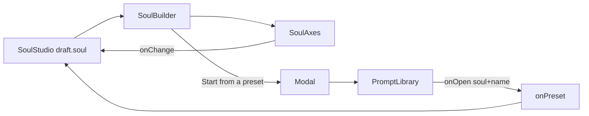

# SoulBuilder.tsx — AI component doc

> AI-facing sidecar for `SoulBuilder.tsx`. Created 2026-07-21. Keep this in sync with the code on every change.

## Purpose

The studio's right BUILDER panel: the shared `SoulAxes` under a "start from a
preset" shortcut. It is the controlled surface where the character's spec is
edited on `/soul`, feeding the same draft the center stage and the composer read.

## What it does (for an AI reader)

- Responsibilities: frame `SoulAxes` in a titled glass card; expose the preset
  shortcut (a header button that opens a Modal wrapping `PromptLibrary`); relay
  every soul change and every preset pick to the studio owner.
- Public API / exports: `SoulBuilder`, `SoulBuilderProps` (`soul`,
  `onChange(soul)`, `onPreset(soul, name)`).
- Inputs → Outputs: a `Soul` → `onChange(new soul)`; a preset pick →
  `onPreset(soul, name)` + close.
- Side effects: local `isPresetOpen` state only.

## Dependencies

- Imports: `shared/ui` (`Button`, `Card`, `Modal`); `./SoulAxes`;
  `./PromptLibrary`; `@opencreate/contracts` `Soul` type.
- Used by: `components/SoulStudio.tsx` (the right zone of the 3-zone studio).

## Diagram

## Key decisions / gotchas

- Only touches the SOUL, never the name — the name lives in the composer dock, so
  the two surfaces never fight over one field.
- The preset Modal is OPAQUE steel (its default): PromptLibrary is a glass card,
  and glass over a dimmed page reads cleanly, whereas glass-on-glass doubles the
  frost.
- PromptLibrary is REUSED unchanged: its `onOpen` still hands back a whole `Soul`
  literal + a name, the ADR payoff that a preset is structure, not a string.

## Commits

- _no commit yet_
