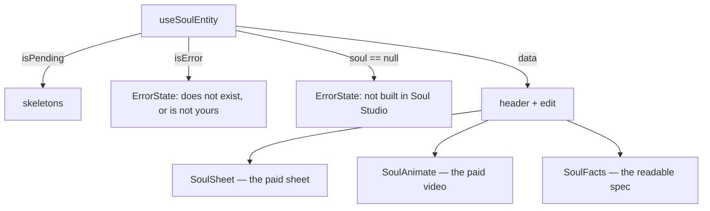

# SoulCard.tsx — AI component doc

> AI-facing sidecar for `SoulCard.tsx`. Created 2026-07-12. Keep this in sync with the code on every change.

## Purpose

The character's page: the reference sheet, what it IS, and how to bring it to life.
Composition plus the four states over ONE entity — every paid action lives in its
children.

## What it does (for an AI reader)

- Responsibilities: loading skeletons → error + retry → "not a soul character" →
  the card (header + `SoulSheet` + `SoulAnimate` + `SoulFacts` + the edit modal).
- Public API / props: `{ entityId: string, models: CatalogModel[] }`.
- Inputs → Outputs: a route param + the catalog → the character page.
- Side effects: `useSoulEntity` (`GET /api/entities/:id`).

## Dependencies

- Imports: `react`, `react-i18next`, `@tanstack/react-router` (`Link`),
  `@opencreate/contracts` (type `CatalogModel`), `shared/ui` (`Button`,
  `ErrorState`, `Skeleton`), `../model/soulApi`, siblings `SoulSheet`,
  `SoulAnimate`, `SoulFacts`, `SoulEditModal`.
- Used by: `routes/_shell.soul.$entityId.tsx` via the module's public API.

## Diagram

## Key decisions / gotchas

- `models` arrives as a PROP: the catalog hook belongs to `modules/Generator`, and a
  module may not import another module. The ROUTE is the seam (the same pattern as
  `/cinema/$filmId` → `FilmEditor`).
- A soul-less entity is not a crash: `entity.soul == null` renders a calm "wrong
  screen" message instead of exploding on `entity.soul.styleId`.
- The edit modal is mounted only while open, so each edit starts from the saved soul.

## Commits

- _no commit yet_
