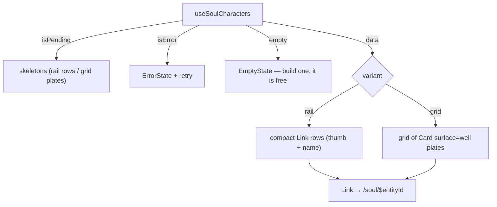

# SoulCharacters.tsx — AI component doc

> AI-facing sidecar for `SoulCharacters.tsx`. Created 2026-07-12. Keep this in sync with the code on every change.

## Purpose

The user's own characters leading into the soul card — the 4 UI states over the
shared `['entities']` query, filtered to the entities that actually have a soul.
Two layouts share those states: `grid` (the browsing plate wall) and `rail` (the
studio's compact left column, added 2026-07-21).

## What it does (for an AI reader)

- Responsibilities: loading (skeletons) → error + retry → empty state → data,
  where data is a plate grid or a compact row rail per `variant`; show the primary
  photo, or a "no portrait yet" note.
- Public API / props: `SoulCharactersProps` (`variant?: 'grid' | 'rail'`,
  default `grid`). It owns its own query.
- Inputs → Outputs: `useSoulCharacters()` → tiles/rows linking to `/soul/$entityId`.
- Side effects: `GET /api/entities` (shared cache with `/entities`).

## Dependencies

- Imports: `react-i18next`, `@tanstack/react-router` (`Link`), `shared/ui` (`Card`,
  `EmptyState`, `ErrorState`, `Skeleton`), `../model/soulApi`.
- Used by: `SoulStudio` (rail, left zone). The grid variant is available for reuse.
- Tested by: `SoulCharacters.test.tsx` (the 4 states of the rail).

## Diagram

## Key decisions / gotchas

- A cover photo is CONTENT: the tile is a recessed `well` Card, never frosted glass
  (design.md §3.5, same reasoning as `GenerationCard`). A face the user paid 26
  credits for must read as a face.
- The `Link` sits INSIDE the Card (Card renders a `
`), so the plate owns the
  hover lift and the link owns an INSET focus ring — an outset ring would be
  clipped by `overflow-hidden`.
- "No portrait yet" is the NORMAL first state: creation is free, the photo is the
  paid act. The empty state says so rather than nagging.
- The filter is a `select` on the SHARED `['entities']` cache — `/soul` and
  `/entities` cost one fetch between them, and no module imports the other.
- ONE query, two layouts: the 4 states are computed once and only the DATA branch
  forks on `variant`. The rail can never silently skip a loading/error/empty state
  the grid handles.
- The rail row is the WHOLE `Link` (thumb + name), not a well card, because the
  narrow column has no room for a plate wall — but it still leads to the same soul
  card, so paid minting stays off `/soul`.

## Commits

- _no commit yet_
