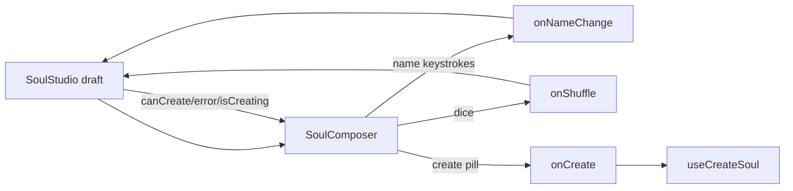

# SoulComposer.tsx — AI component doc

> AI-facing sidecar for `SoulComposer.tsx`. Created 2026-07-21. Keep this in sync with the code on every change.

## Purpose

The studio's bottom COMPOSER DOCK body — the ONE create action on `/soul`. A
floating-glass capsule holding the character name, a shuffle dice, the single
green "Create character" pill and the "creating is free" caption, mirroring the
Cinema editor's fixed dock.

## What it does (for an AI reader)

- Responsibilities: render the name field, the shuffle button, the create pill
  and the inline error/free caption; relay every interaction upward. It owns NO
  draft and NO layout (SoulStudio pins it position:fixed).
- Public API / exports: `SoulComposer`, `SoulComposerProps` (`name`,
  `onNameChange`, `onShuffle`, `onCreate`, `isCreating`, `canCreate`, `error`).
- Inputs → Outputs: keystrokes → `onNameChange`; clicks → `onShuffle` / `onCreate`.
- Side effects: none (fully controlled).

## Dependencies

- Imports: `shared/ui` (`Button`, `GLASS_FLOATING`).
- Used by: `components/SoulStudio.tsx` (rendered inside the fixed dock wrapper).

## Diagram

## Key decisions / gotchas

- `GLASS_FLOATING` (not `GLASS_SURFACE`): this is chrome hovering OVER scrolling
  content, so it uses the design system's floating elevation — never a bespoke
  shadow.
- The name field is a translucent white/5 glass field (not the steel `Input`
  primitive): the capsule is glass, and an aria-label carries the accessible name
  in the dense dock — the same trade the Cinema prompt makes.
- The shuffle glyph is a decorative `currentColor` SVG, NEVER an OS emoji (the
  design law, same as BalanceChip's bolt).
- The create pill is `Button` primary = green (the create tint) and is disabled
  by `canCreate` (`isDraftReady`) — the studio owns that gate.
- SoulStudio's shuffle handler preserves the typed name around the random roll,
  so pressing the dice never wipes a name the user already entered.

## Commits

- _no commit yet_
