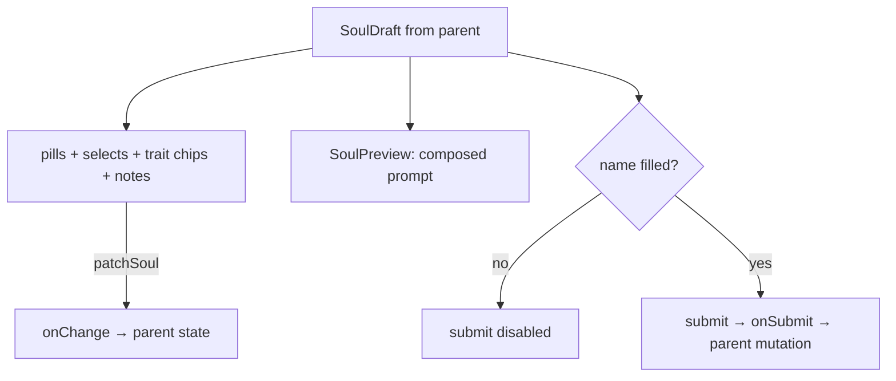

# SoulConstructor.tsx — AI component doc

> AI-facing sidecar for `SoulConstructor.tsx`. Created 2026-07-12. Keep this in sync with the code on every change.

## Purpose

The constructor: a character is BUILT from tables here, never typed into a prompt
box. Two required axes as pills, eight optional axes as dropdowns, the capped trait
chips, a free-text notes tail, the live composed prompt, and one submit pill.

## What it does (for an AI reader)

- Responsibilities: render every picker from the contract tables (via
  `model/soulOptions`); patch the draft one axis at a time; enforce the trait cap
  through `toggleTrait`; show the live preview; disable submit until the character
  has a name.
- Public API / props: `{ draft, onChange, onSubmit, submitLabel, isSubmitting, error? }`.
- Inputs → Outputs: a `SoulDraft` → picker UI → a patched `SoulDraft` via `onChange`.
- Side effects: none — the PARENT owns the mutation (create on `/soul`, update in
  the soul card's edit modal).

## Dependencies

- Imports: `react-i18next`, `@opencreate/contracts` (types), `shared/ui` (`Button`,
  `Card`, `Input`, `PillGroup`, `Select`), `../model/soulOptions`,
  `../model/soulDraft`, siblings `SoulPreview` + `TraitPicker`.
- Used by: `SoulStudio` (create) and `SoulEditModal` (edit).
- Tested by: `SoulConstructor.test.tsx` (cap, live preview, name gate).

## Diagram

## Key decisions / gotchas

- CONTROLLED on purpose: "open in constructor" from the prompt library REPLACES the
  whole draft from outside, so exactly one owner (the parent) may hold it. A
  self-owned state could only be reset by remounting with a key — throwing away
  scroll and focus every time.
- Required axes (archetype, style) are pills; optional axes are Selects with an
  "any" row, because an unset axis is a real choice and must be reachable.
- `optionalValue('')` → `undefined`: the schema has no 'none' sentinel, so unset
  means the key is absent, not an empty string.
- Creating a character is FREE, and the line beside the submit pill says so — every
  other button in this app charges credits and the user has learned to expect it.
- The error line is a steel block with a glow-red LEFT RULE: red marks the status,
  never the whole surface (design.md §9).

## Commits

- _no commit yet_
