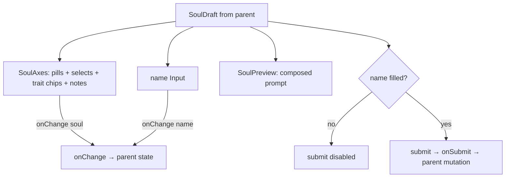

# SoulConstructor.tsx — AI component doc

> AI-facing sidecar for `SoulConstructor.tsx`. Created 2026-07-12. Keep this in sync with the code on every change.

## Purpose

The EDIT-MODAL form (since the 2026-07-21 /soul recomposition): the whole
character constructor in one column — name, the shared axes (`SoulAxes`), the
live composed prompt, and one submit pill. The studio page no longer uses it; it
spreads the same parts across three zones (SoulBuilder + SoulStage + SoulComposer).

## What it does (for an AI reader)

- Responsibilities: render the name field; delegate every picker to `SoulAxes`;
  show the live `SoulPreview`; disable submit until the character has a name.
- Public API / props: `{ draft, onChange, onSubmit, submitLabel, isSubmitting, error? }`.
- Inputs → Outputs: a `SoulDraft` → name + axis UI → a patched `SoulDraft` via `onChange`.
- Side effects: none — the PARENT owns the mutation (update in the soul card's
  edit modal).

## Dependencies

- Imports: `react-i18next`, `shared/ui` (`Button`, `Card`, `Input`),
  `../model/soulDraft` (type), siblings `SoulAxes` + `SoulPreview`.
- Used by: `SoulEditModal` (edit). No longer used by `SoulStudio` (recomposed).
- Tested by: `SoulConstructor.test.tsx` (cap via SoulAxes, live preview, name gate).

## Diagram

## Key decisions / gotchas

- The axes moved to `SoulAxes` so the studio's Builder and this modal render the
  SAME pickers and cannot drift. The DOM order is unchanged (name → axes →
  preview → submit), which is why `SoulConstructor.test.tsx` stayed green.
- CONTROLLED on purpose: the parent owns the draft. A self-owned state could only
  be reset by remounting with a key — throwing away scroll and focus every time.
- Creating/saving is FREE, and the line beside the submit pill says so — every
  other button in this app charges credits and the user has learned to expect it.
- The error line is a steel block with a glow-red LEFT RULE: red marks the status,
  never the whole surface (design.md §9).

## Commits

- _no commit yet_
