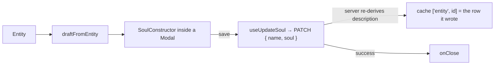

# SoulEditModal.tsx — AI component doc

> AI-facing sidecar for `SoulEditModal.tsx`. Created 2026-07-12. Keep this in sync with the code on every change.

## Purpose

Reopen a built character in the constructor and save the new spec. Free — editing
generates nothing, and the portraits already minted stay exactly as they are (a
re-roll is a separate, priced act on the sheet).

## What it does (for an AI reader)

- Responsibilities: seed a draft from the entity, render `SoulConstructor` inside a
  `Modal`, PATCH `{ name, soul }`, close on success.
- Public API / props: `{ entity: Entity, isOpen: boolean, onClose: () => void }`.
- Inputs → Outputs: an entity → an edited `Soul` → `PATCH /api/entities/:id`.
- Side effects: `useUpdateSoul` (seeds `['entity', id]`, invalidates `['entities']`).

## Dependencies

- Imports: `react`, `react-i18next`, `@opencreate/contracts` (type `Entity`),
  `shared/libs/apiClient`, `shared/libs/errorCopy`, `shared/ui` (`Modal`),
  `../model/soulApi`, `../model/soulDraft`, sibling `SoulConstructor`.
- Used by: `SoulCard` (mounted only while open).

## Diagram

## Key decisions / gotchas

- No description field, ever: `soul != null ⟹ description is DERIVED` (entity.ts).
  There is nothing right the client could send.
- The CARD mounts this only while open, so each reopen starts from the SAVED soul —
  no effect is needed to reset the draft, and an abandoned edit cannot leak.

## Commits

- _no commit yet_
