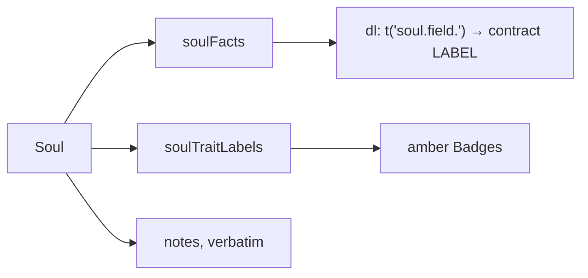

# SoulFacts.tsx — AI component doc

> AI-facing sidecar for `SoulFacts.tsx`. Created 2026-07-12. Keep this in sync with the code on every change.

## Purpose

"Its characteristics" — the readable half of the soul card, and the payoff of storing
the spec as STRUCTURE: we can print «Существо · Комикс · Рога» instead of 400
characters of English fragment soup the user never wrote.

## What it does (for an AI reader)

- Responsibilities: render `soulFacts` as a definition list, the traits as badges,
  and the notes verbatim.
- Public API / props: `{ soul: Soul }`.
- Inputs → Outputs: the stored soul → `<dl>` rows + trait chips + notes.
- Side effects: none.

## Dependencies

- Imports: `react-i18next`, `@opencreate/contracts` (type `Soul`), `shared/ui`
  (`Badge`, `Card`), `../model/soulPresentation`.
- Used by: `SoulCard`.

## Diagram

## Key decisions / gotchas

- A definition list, not a table: these are name/value pairs and a screen reader
  should read them as such.
- The VALUES are contract labels (already Russian, like `STYLE_PRESETS`); only the
  AXIS NAMES are app copy and go through i18n (`soul.field.*`).
- Unset axes are absent (they contribute nothing to the prompt), and traits are
  sliced at `MAX_TRAITS` — the card must not promise a 7th trait the picture never
  contained.

## Commits

- _no commit yet_
