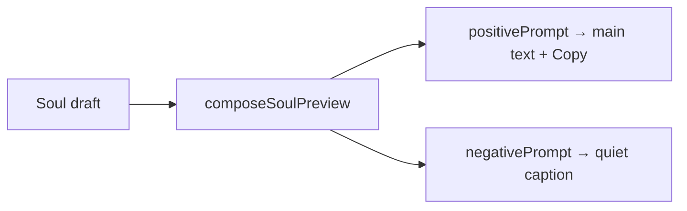

# SoulPreview.tsx — AI component doc

> AI-facing sidecar for `SoulPreview.tsx`. Created 2026-07-12. Keep this in sync with the code on every change.

## Purpose

"What the model will see": the live composed prompt for the hero portrait, plus its
negative, plus a Copy button. It is how the user learns that clicking chips produces
a specific sentence — and it cannot lie, because it calls the same contract
composers the API composes with.

## What it does (for an AI reader)

- Responsibilities: run `composeSoulPreview(soul)` and render the positive prompt
  (with `data-testid="soul-preview"`) and, quietly, the negative.
- Public API / props: `{ soul: Soul }`.
- Inputs → Outputs: the draft soul → the composed `{ positivePrompt, negativePrompt }`.
- Side effects: none.

## Dependencies

- Imports: `react-i18next`, `@opencreate/contracts` (type `Soul`), `shared/ui`
  (`Card surface="well"`), `../model/soulPresentation`, sibling `CopyButton`.
- Used by: `SoulConstructor`.

## Diagram

## Key decisions / gotchas

- A recessed `well` Card: the prompt is the machine's text, sunk one step below the
  controls that produce it — not a frosted panel competing with them.
- The NEGATIVE is shown on purpose. It is half of what makes a reference sheet
  clean (no busy background, no second character, no watermark); a user who cannot
  see it cannot understand why their character came out on a plain backdrop.
- Nothing is concatenated here. Composition belongs to contracts (ADR §2).

## Commits

- _no commit yet_
