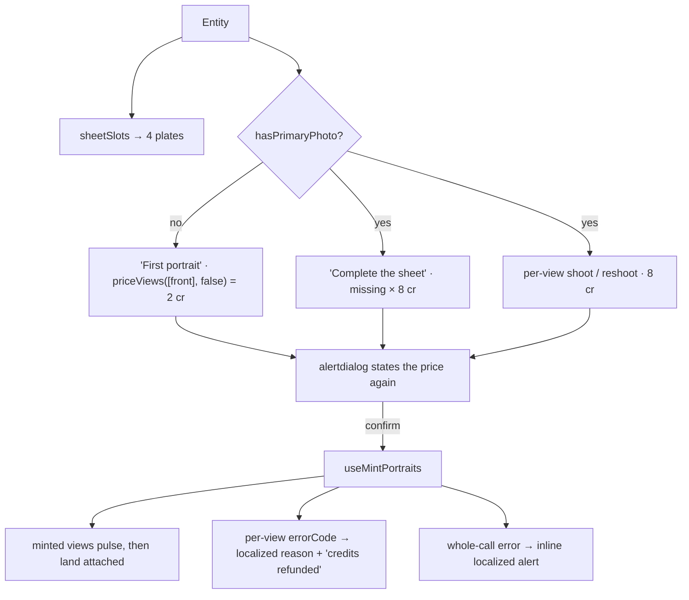

# SoulSheet.tsx — AI component doc

> AI-facing sidecar for `SoulSheet.tsx`. Created 2026-07-12. Keep this in sync with the code on every change.

## Purpose

The reference sheet — four views of the same person — and the only surface in Soul
Studio that spends money. It therefore carries the whole cost UX: the price on the
button before the click, a confirm dialog before the charge, and a visible, refunded
failure per view.

## What it does (for an AI reader)

- Responsibilities: render the four `PORTRAIT_SHEET_VIEWS` slots (filled or empty);
  price and fire the hero mint (no photo yet) or the remaining views (photo exists);
  offer a per-view shoot/reshoot; surface per-view failures and whole-call errors.
- Public API / props: `{ entity: Entity, models: CatalogModel[] }`.
- Inputs → Outputs: entity + catalog → priced buttons → `POST /api/entities/:id/portraits`.
- Side effects: `useMintPortraits` (charges credits server-side; invalidates
  `['entities']`, `['generations']`, `['me']`).

## Dependencies

- Imports: `react`, `react-i18next`, `@opencreate/contracts`
  (`PORTRAIT_SHEET_VIEWS`, `PORTRAIT_VIEWS`), `shared/libs/apiClient`
  (`ApiClientError`), `shared/libs/errorCopy`, `shared/ui` (`Badge`, `Button`,
  `Card`, `Modal`, `Skeleton`), `../model/soulApi`, `../model/portraitSheet`.
- Used by: `SoulCard`.
- Tested by: `SoulSheet.test.tsx` (both prices, the confirm gate, the failed view).

## Diagram

## Key decisions / gotchas

- The price is READ FROM THE CATALOG (`portraitSheet.priceViews`), never hardcoded:
  2 while the character has no photo, 8 per view once it does, because later views
  must self-reference the first on `flux-kontext-pro` or the sheet is four
  strangers. A `null` price disables the button — never a guess.
- NOTHING spends in one click: every mint goes through a `role="alertdialog"`
  confirm that repeats the number (design.md §9).
- The hero and the rest are TWO acts (2 credits, then 24) — never one 26-credit
  button. The first portrait is also the decision about who this character is, and
  the user should be allowed to hate it cheaply.
- Confirming CLOSES the dialog and moves the work onto the plates (`mintingViews`),
  so the user watches the sheet fill rather than a spinner in a modal.
- A per-view failure is a REFUNDED failure. The API reports a machine-readable
  `errorCode`, so we print our own localized sentence (`errorCopy`) — never the
  provider's English text under a Russian heading.
- The view labels come from `PORTRAIT_VIEWS` (contract data, already Russian).

## Commits

- _no commit yet_
