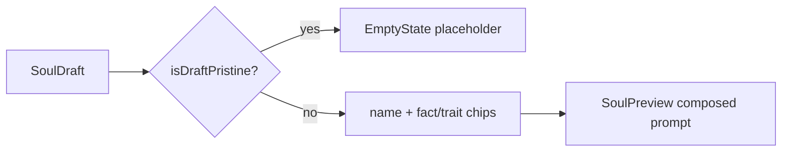

# SoulStage.tsx — AI component doc

> AI-facing sidecar for `SoulStage.tsx`. Created 2026-07-21. Keep this in sync with the code on every change.

## Purpose

The studio's center STAGE: the honest live preview of a not-yet-shot character —
its name, its picked axes and traits as chips, and the exact prompt the portrait
mint will submit. There is no image because a face is minted later, for credits,
on the soul card.

## What it does (for an AI reader)

- Responsibilities: show a "start building" placeholder while the draft is
  pristine; otherwise render the character's structure (name, fact chips, amber
  trait chips) plus the composed `SoulPreview`.
- Public API / exports: `SoulStage`, `SoulStageProps` (`draft`).
- Inputs → Outputs: a `SoulDraft` → either an `EmptyState` or the live preview.
- Side effects: none (pure function of the draft).

## Dependencies

- Imports: `shared/ui` (`Badge`, `Card`, `EmptyState`); `model/soulDraft`
  (`isDraftPristine`, `SoulDraft`); `model/soulPresentation` (`soulFacts`,
  `soulTraitLabels`); `./SoulPreview`.
- Used by: `components/SoulStudio.tsx` (the center zone of the 3-zone studio).

## Diagram

## Key decisions / gotchas

- TWO states, not four: the draft is CLIENT state, so the 4-states rule (server
  data) does not apply. The pristine placeholder is honesty, not a loading state.
- Never previews a DEFAULT character: showing "a woman, Disney style" before any
  pick would be a lie dressed as a preview, which is why `isDraftPristine` gates
  it and flips on the first change.
- Reuses `SoulPreview` and the `soulPresentation` functions — the prompt is the
  SAME contract-composed text the constructor shows, never re-typed, so it cannot
  drift into a plausible lie.
- Chips use contract LABELS (`soulFacts`/`soulTraitLabels`), keyed by axis/label
  (never index) — traits in the amber selection tint, axes neutral.

## Commits

- _no commit yet_
