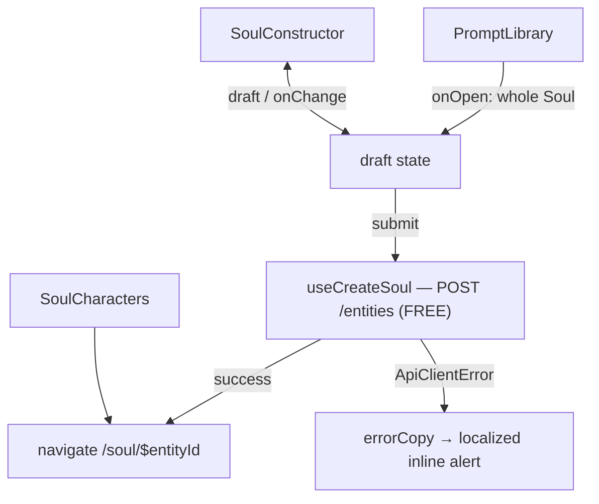

# SoulStudio.tsx — AI component doc

> AI-facing sidecar for `SoulStudio.tsx`. Created 2026-07-12. Keep this in sync with the code on every change.

## Purpose

The `/soul` page body: build a character (constructor), start from a ready-made one
(prompt library), or open one you already made (characters). It OWNS the draft,
which is the reason it exists rather than the route composing three siblings.

## What it does (for an AI reader)

- Responsibilities: hold the `SoulDraft`; let the library replace it wholesale;
  create the character (free) and navigate into its soul card.
- Public API / props: none.
- Inputs → Outputs: user input → `POST /api/entities` → `/soul/$entityId`.
- Side effects: `useCreateSoul` (mutation), `window.scrollTo` on open-in-constructor,
  router navigation on success.

## Dependencies

- Imports: `react`, `react-i18next`, `@tanstack/react-router` (`useNavigate`),
  `shared/libs/apiClient` (`ApiClientError`), `shared/libs/errorCopy`,
  `../model/soulApi`, `../model/soulDraft`, siblings `SoulConstructor`,
  `PromptLibrary`, `SoulCharacters`.
- Used by: `routes/_shell.soul.index.tsx` via the module's public API.

## Diagram

## Key decisions / gotchas

- ONE owner of the draft: "open in constructor" is a write from the library INTO the
  constructor, so both must touch the same state.
- Creating a character spends NO credits. The paid acts (2 credits, then 8 each,
  then 35–140 for video) live on the soul card — keeping the free act and the paid
  act on different screens is the cheapest protection against a 26-credit accident.
- Failures render through `errorCopy`, never as raw server text.

## Commits

- _no commit yet_
