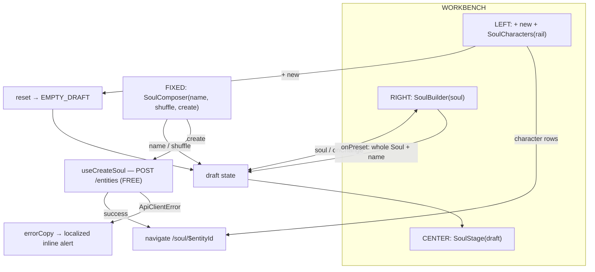

# SoulStudio.tsx — AI component doc

> AI-facing sidecar for `SoulStudio.tsx`. Created 2026-07-12. Keep this in sync with the code on every change.

## Purpose

The `/soul` page body: a 3-ZONE STUDIO (2026-07-21 recomposition) — a
viewport-height workbench with a LEFT RAIL (reset + character rail), a CENTER
STAGE (live draft), a RIGHT BUILDER (axes + preset), and a fixed BOTTOM COMPOSER
DOCK (the one create action). It OWNS the draft, which is the reason it exists
rather than the route composing siblings.

## What it does (for an AI reader)

- Responsibilities: hold the `SoulDraft`; let a preset replace it wholesale; reset
  it (create new); shuffle it (keeping the typed name); create the character (free)
  and navigate into its soul card.
- Public API / props: none.
- Inputs → Outputs: user input across three zones → `POST /api/entities` →
  `/soul/$entityId`.
- Side effects: `useCreateSoul` (mutation); router navigation on success.

## Dependencies

- Imports: `react`, `react-i18next`, `@tanstack/react-router` (`useNavigate`),
  `shared/libs/apiClient` (`ApiClientError`), `shared/libs/errorCopy`,
  `../model/soulApi`, `../model/soulDraft` (`EMPTY_DRAFT`, `isDraftReady`),
  `../model/randomizeDraft`, siblings `SoulBuilder`, `SoulCharacters` (rail),
  `SoulComposer`, `SoulStage`.
- Used by: `routes/_shell.soul.index.tsx` via the module's public API.
- Tested by: `SoulStudio.test.tsx` (zones, create gate, create+navigate, preset fill).

## Diagram

## Key decisions / gotchas

- ONE owner of the draft: a preset write, a shuffle, a reset and a name keystroke
  all mutate the SAME draft the stage, the builder and the composer read.
- Desktop-first workbench: `lg:h-[calc(100svh-76px)]` locks the viewport and each
  zone scrolls internally; below `lg` the zones STACK (rail → builder → stage) and
  the page scrolls, because a viewport-locked 3-column grid is unusable at 390px.
- The composer is position:fixed (mirroring the cinema dock) so the create action
  never eats workbench height; `pb-28` reserves its collapsed clearance. z-40
  floats over the workbench but under the preset Modal's z-50.
- Shuffle preserves the typed name around `randomizeDraft()` (which returns an
  empty name) — a dice press must not wipe a name the user entered.
- Creating a character spends NO credits. The paid acts (2 credits, then 8 each,
  then 35–140 for video) live on the soul card — keeping the free act and the paid
  act on different screens is the cheapest protection against a 26-credit accident.
- Failures render through `errorCopy`, never as raw server text.

## Commits

- _no commit yet_
