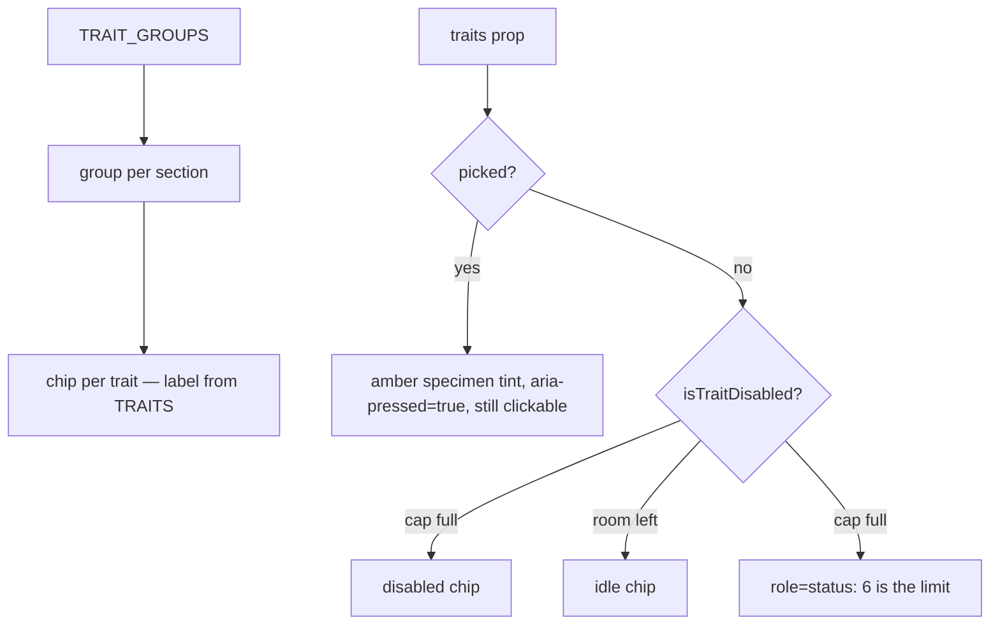

# TraitPicker.tsx — AI component doc

> AI-facing sidecar for `TraitPicker.tsx`. Created 2026-07-12. Keep this in sync with the code on every change.

## Purpose

The multi-select trait axis — missing eye, iron arm, horns, scars — rendered as
chip groups straight from `TRAIT_GROUPS`, and the surface where the MAX_TRAITS cap
is made visible: at six, the remaining chips are disabled and a `role="status"`
line says why.

## What it does (for an AI reader)

- Responsibilities: render one chip group per `TRAIT_GROUPS` entry; mark picked
  chips with `aria-pressed`; disable unpicked chips at the cap; announce the cap.
- Public API / props: `{ traits: TraitId[], onToggle: (id: TraitId) => void }`.
- Inputs → Outputs: the picked traits → chips + a toggle callback.
- Side effects: none (the parent owns the draft).

## Dependencies

- Imports: `react-i18next`, `@opencreate/contracts` (`TRAITS`, `TRAIT_GROUPS`,
  `MAX_TRAITS`), `../model/soulDraft` (`isTraitDisabled`).
- Used by: `SoulConstructor`.

## Diagram

## Key decisions / gotchas

- The cap must REFUSE VISIBLY. A text encoder silently drops concepts past a
  handful, so a 15-trait character renders as a 4-trait one — the user paid for
  all fifteen. Disabling the chip (rather than ignoring the click) is the honest
  version of that fact; `toggleTrait` refuses a second time in the model.
- Picked chips stay enabled at the cap, or the user is stuck at six.
- The counter interpolates `picked`, not `count`: `count` would put i18next into
  plural-resolution mode and demand `_one/_few/_many` keys for "3 / 6".
- Group and trait labels are contract DATA (already Russian) — not app copy, so
  they do not go through i18n. Only the caption, counter and cap sentence do.
- The cap line is AMBER, not red: nothing failed — the studio is protecting a
  render the user is about to pay for.

## Commits

- _no commit yet_
