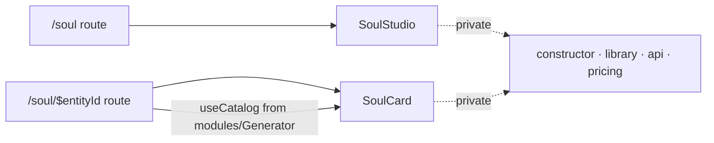

# index.ts — AI component doc

> AI-facing sidecar for `modules/Soul/index.ts`. Created 2026-07-12. Keep this in sync with the code on every change.

## Purpose

The Soul module's public API. Routes import ONLY from `modules/Soul`; the
constructor, the sheet, the pricing math and the query hooks are private.

## What it does (for an AI reader)

- Public API / exports: `SoulStudio` (the `/soul` body), `SoulCard` + `SoulCardProps`
  (the `/soul/$entityId` body).
- Side effects: none.

## Dependencies

- Imports: `./components/SoulStudio`, `./components/SoulCard`.
- Used by: `routes/_shell.soul.index.tsx`, `routes/_shell.soul.$entityId.tsx`.

## Diagram

## Key decisions / gotchas

- `SoulCard` takes the catalog as a PROP instead of reading it: the catalog hook is
  Generator's, and modules never import each other. The route is the seam.

## Commits

- _no commit yet_
