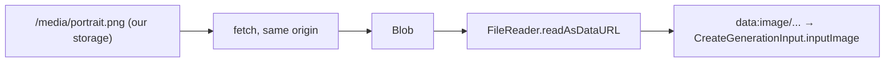

# imageToDataUri.ts — AI component doc

> AI-facing sidecar for `imageToDataUri.ts`. Created 2026-07-12. Keep this in sync with the code on every change.

## Purpose

Reads one of our own stored images (an entity portrait, served from `/media`)
back into a data URI, because that is the only shape `POST /api/generations`
accepts for `inputImage`. It is what makes "Оживить" possible without the API
ever fetching a URL a client handed it.

## What it does (for an AI reader)

- Responsibilities: fetch the image, turn the blob into a base64 data URI, fail
  loudly on a bad response.
- Public API / exports: `imageToDataUri(url): Promise<string>`.
- Inputs → Outputs: a same-origin image URL → `data:image/...;base64,...`.
- Side effects: one `fetch` (credentials included, same origin) + a `FileReader`
  read.

## Dependencies

- Imports: none (browser `fetch` + `FileReader`).
- Used by: `model/soulApi.ts` → `useAnimateSoul` (the mutation converts the
  primary portrait before POSTing the video generation).

## Diagram

## Key decisions / gotchas

- The bytes make a round trip through the browser ON PURPOSE. The API never
  fetches a client-supplied URL (the SSRF guard documented in `entity.ts`), so the
  generation contract takes a data URI and nothing else. A few hundred KB on one
  explicit, priced click is the price of that guarantee.
- Entity image URLs always point at OUR storage — portraits are copied in on
  attach, never linked from the provider (Runware assets expire after 7 days). So
  this is a same-origin read; no CORS mode is set, because a cross-origin read
  would hand back an opaque blob we could not encode.
- Rejects rather than returning an empty string on failure: the caller (a paid
  mutation) must surface a failure, not submit a video request with no image.

## Commits

- _no commit yet_
