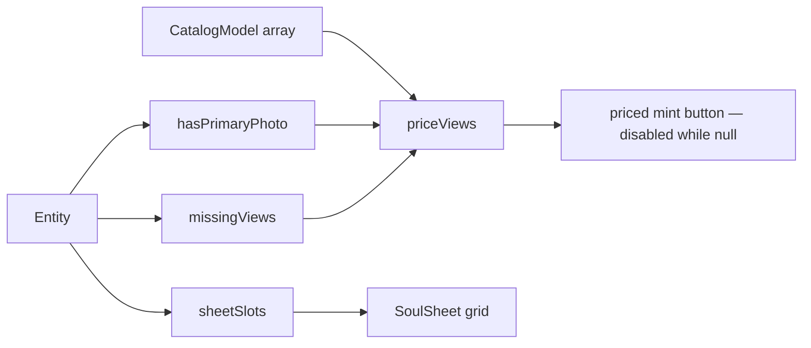

# portraitSheet.ts — AI component doc

> AI-facing sidecar for `portraitSheet.ts`. Created 2026-07-12. Keep this in sync with the code on every change.

## Purpose

The reference sheet expressed as pure data: which of the four portrait views is
filled, which is missing, and what minting a given set of views costs RIGHT NOW.
Every priced button in Soul Studio reads its number from here, so the price is on
screen before the click — never discovered after the charge.

## What it does (for an AI reader)

- Responsibilities: map an `Entity`'s images onto the four `PORTRAIT_SHEET_VIEWS`
  slots; report whether a primary photo exists (the state the server's model rule
  keys on); price a set of views against the live catalog.
- Public API / exports:
  - `sheetSlots(entity): SheetSlot[]` — always 4 slots, always in sheet order.
  - `hasPrimaryPhoto(entity): boolean`
  - `missingViews(entity): PortraitView[]`
  - `heroCredits(models) / sheetCredits(models): number | null`
  - `priceViews(views, entityHasPrimaryPhoto, models): number | null`
- Inputs → Outputs: `Entity` + `CatalogModel[]` → slots / missing views / a credit
  total (or `null` when the catalog has not landed).
- Side effects: none. Pure functions only — the arithmetic behind every priced
  button is provable without a network (`portraitSheet.test.ts`).

## Dependencies

- Imports: `@opencreate/contracts` (`PORTRAIT_SHEET_VIEWS`, `SOUL_HERO_MODEL_ID`,
  `SOUL_SHEET_MODEL_ID`; types `CatalogModel`, `Entity`, `EntityImage`, `PortraitView`).
- Used by: `components/SoulSheet.tsx` (the grid + the priced mint buttons), which
  the `SoulCard` composes.

## Diagram

## Key decisions / gotchas

- The price MIRRORS the server's model rule (ADR §3): with no primary photo the
  first view is the 2-credit hero on `flux-dev`, and every later view
  self-references it on the 8-credit `flux-kontext-pro`. A fresh four-view sheet
  is therefore 2 + 3×8 = 26. The web never CHOOSES the model — it only prints
  what the server will charge.
- Credits are read off the live catalog, never hardcoded: `flux-kontext-pro`'s 8
  is explicitly provisional in the catalogue, and a re-price must not leave a
  button lying about what the user is about to spend.
- `null` means "price unknown" → the caller disables the action. Never guess.
- `hasPrimaryPhoto` keys on `primaryImageId`, not on `images.length`: an uploaded
  photo is a legal reference too, and the server treats it the same way.
- A slot is filled only by an image whose `view` matches it; an ordinary upload
  (`view: null`) never occupies a sheet slot.

## Commits

- _no commit yet_
