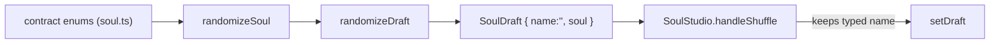

# randomizeDraft.ts — AI component doc

> AI-facing sidecar for `randomizeDraft.ts`. Created 2026-07-21. Keep this in sync with the code on every change.

## Purpose

A whole random, VALID character in one call — the pure function behind the
studio composer's «shuffle» (dice) button. It exists so a user who does not know
where to start gets a buildable starting point instead of a blank form.

## What it does (for an AI reader)

- Responsibilities: draw a random `Soul` from the contract enums (the two
  required axes always set, a coin-flip on each of the eight optional axes,
  0..MAX_TRAITS distinct traits) and wrap it in a `SoulDraft` with an empty name.
- Public API / exports: `randomizeDraft(): SoulDraft`.
- Inputs → Outputs: none → a fresh `SoulDraft` whose `soul` satisfies `soulSchema`.
- Side effects: none — but NOT deterministic (uses `Math.random`).

## Dependencies

- Imports: `@opencreate/contracts` (`MAX_TRAITS`, `TRAITS`, the ten axis
  schemas; types `Soul`, `TraitId`); `./soulDraft` (`EMPTY_DRAFT`, `SoulDraft`).
- Used by: `components/SoulStudio.tsx` (the composer's shuffle handler, which
  preserves the typed name around the fresh soul).

## Diagram

## Key decisions / gotchas

- Every value comes from a zod enum's `.options` / `Object.keys(TRAITS)` — NEVER
  a hardcoded list. That is what keeps the shuffle in lockstep with contracts: a
  new archetype/trait widens it for free, and a pickable value is by construction
  a value the schema and API accept.
- Traits are a random-length PREFIX of a shuffled id list, so they are distinct
  by construction and can never trip `soulSchema`'s `.max(MAX_TRAITS)`.
- Optional axes are a 50% coin-flip each: a shuffled character should read as a
  person, not a maxed-out spec sheet. `EMPTY_SOUL`'s "unset axis contributes
  nothing" invariant means a skipped axis is a real, honest choice.
- Name starts empty: shuffling the LOOK must not invent a name. The composer's
  shuffle handler re-attaches the user's typed name, so a shuffle never wipes it.

## Commits

- _no commit yet_
