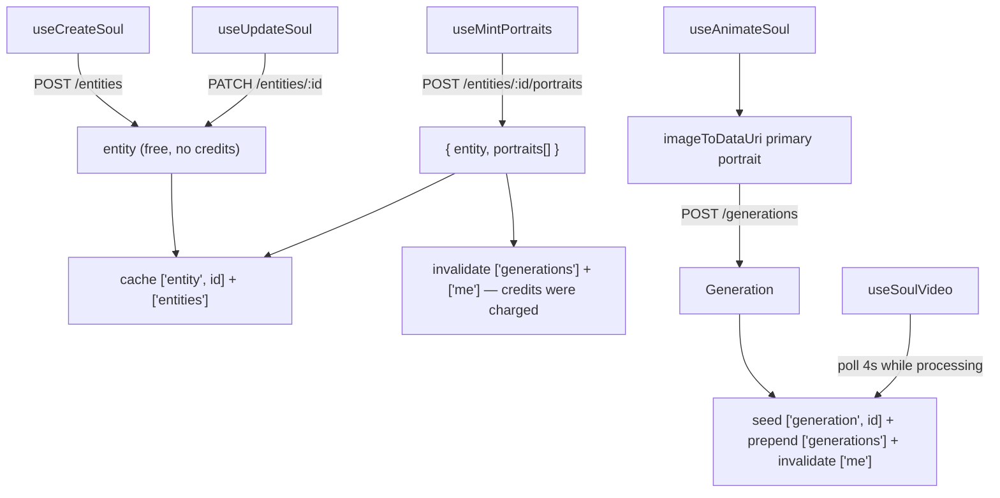

# soulApi.ts — AI component doc

> AI-facing sidecar for `soulApi.ts`. Created 2026-07-12. Keep this in sync with the code on every change.

## Purpose

The TanStack Query layer for Soul Studio. A soul character IS an entity, so this
file talks to the existing entity/generation endpoints and writes the existing
cache keys — it adds no store, no money path and no new subject type.

## What it does (for an AI reader)

- Responsibilities: read the user's soul characters and one character's detail;
  create/update a character (free); mint priced portraits; animate the primary
  portrait into a video; poll that video.
- Public API / exports:
  - `useSoulCharacters()` — `GET /api/entities`, filtered to `soul != null`.
  - `useSoulEntity(id)` — `GET /api/entities/:id`.
  - `useCreateSoul()` — `POST /api/entities { kind: 'character', name, soul }`.
  - `useUpdateSoul()` — `PATCH /api/entities/:id { name?, soul? }`.
  - `useMintPortraits()` — `POST /api/entities/:id/portraits { views }` →
    `{ entity, portraits: [{ view, generationId, error }] }`.
  - `useAnimateSoul()` — `POST /api/generations` with the portrait as `inputImage`.
  - `useSoulVideo(generationId)` — polls `GET /api/generations/:id`.
  - Types `CreateSoulInput`, `UpdateSoulInput`, `AnimateSoulVars`.
- Inputs → Outputs: hook args → server DTOs, plus cache writes (below).
- Side effects (cache): `['entities']` (invalidate), `['entity', id]` (seed),
  `['generations']` (prepend/invalidate), `['generation', id]` (seed + poll),
  `['me']` (invalidate after every paid action — the balance chip).

## Dependencies

- Imports: `@tanstack/react-query`, `@opencreate/contracts` (types only),
  `shared/libs/apiClient`, sibling `imageToDataUri`.
- Used by: every component in `modules/Soul` (`SoulStudio`, `SoulConstructor`,
  `SoulCharacters`, `SoulCard`, `SoulSheet`, `SoulAnimate`).

## Diagram

## Key decisions / gotchas

- `CreateSoulInput` OMITS `description`: the server derives it from the soul
  (`entity.ts` invariant), so there is nothing right the client could send. The
  omission is that invariant stated at the type level.
- The cache is the cross-module SEAM. Soul never imports Entities, Gallery or
  Generator; it writes their keys instead, so the library list, the feed and the
  balance chip all stay in lockstep.
- The portraits call is synchronous and returns the entity with the images already
  attached — no second attach call, so a crash cannot strand a paid portrait.
- A per-view `error` is NOT a failed mutation: the sibling views may have
  succeeded and the failed one was already refunded. The component surfaces it.
- `useAnimateSoul` is a PLAIN `POST /api/generations`. Video is 35–140 credits and
  is never automatic; the only Soul-specific step is encoding the portrait.
- Polling stops on any terminal status and on a first-poll error — the card must
  never freeze on "Generating 40%".

## Commits

- _no commit yet_
