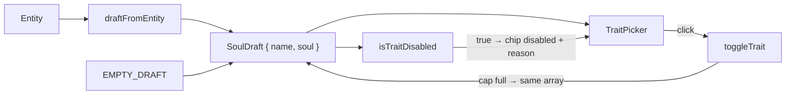

# soulDraft.ts — AI component doc

> AI-facing sidecar for `soulDraft.ts`. Created 2026-07-12. Keep this in sync with the code on every change.

## Purpose

The constructor's editable state (`{ name, soul }`) plus the pure trait-cap rules.
It is where MAX_TRAITS is enforced on the client — as data, not as an onClick.

## What it does (for an AI reader)

- Responsibilities: define the draft shape; provide the empty draft; rebuild a
  draft from an existing entity; add/remove a trait under the cap; report whether
  a trait chip must be disabled.
- Public API / exports: type `SoulDraft`, `EMPTY_SOUL`, `EMPTY_DRAFT`,
  `draftFromEntity(entity)`, `toggleTrait(traits, id)`, `isTraitDisabled(traits, id)`.
- Inputs → Outputs: a draft + a trait id → a new trait array (or the same array,
  when the cap refuses).
- Side effects: none.

## Dependencies

- Imports: `@opencreate/contracts` (`MAX_TRAITS`; types `Entity`, `Soul`, `TraitId`).
- Used by: `components/SoulConstructor.tsx`, `components/TraitPicker.tsx`,
  `components/SoulStudio.tsx` (create draft), `components/SoulEditModal.tsx`
  (edit draft), `components/PromptLibrary.tsx` (open-in-constructor).

## Diagram

## Key decisions / gotchas

- The cap is enforced TWICE on purpose: the chip is disabled (so the user sees
  why) and `toggleTrait` refuses (so a keyboard/AT path cannot slip past). The
  schema and the API refuse it a third time. MAX_TRAITS is not a style preference
  — a text encoder silently drops concepts past a handful, and the user blames us
  for the traits they paid for and did not get.
- Selected chips stay enabled at the cap: un-picking must always be possible, or
  the user is stuck at six with no way back.
- `draftFromEntity` falls back to `EMPTY_SOUL` for a soul-less entity: a
  constructor cannot round-trip prose, which is exactly why `soul` lives BESIDE
  `description` instead of replacing it.
- `EMPTY_SOUL` sets only the two required axes. An unset axis contributes nothing
  to the prompt, so the live preview starts short and honest.

## Commits

- _no commit yet_
