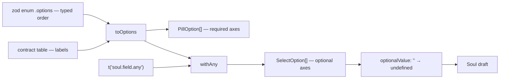

# soulOptions.ts — AI component doc

> AI-facing sidecar for `soulOptions.ts`. Created 2026-07-12. Keep this in sync with the code on every change.

## Purpose

Builds the constructor's picker rows FROM the contract tables, so the options a
user clicks and the fragments the server composes are the same data. The web owns
no list of archetypes, hair colours or outfits — it owns only the layout.

## What it does (for an AI reader)

- Responsibilities: map each soul axis (`archetype`, `styleId`, `age`, `build`,
  `hairColor`, `hairStyle`, `eyeColor`, `skin`, `outfit`, `vibe`) onto
  `PillOption`/`SelectOption` rows in enum order; supply the `''` ("any") sentinel
  for the optional axes and convert it back to `undefined`.
- Public API / exports: `archetypeOptions()`, `styleOptions()`,
  `ageOptions(anyLabel)`, `buildOptions`, `hairColorOptions`, `hairStyleOptions`,
  `eyeColorOptions`, `skinOptions`, `outfitOptions`, `vibeOptions`,
  `optionalValue(value)`, `ANY`, type `Optional<T>`.
- Inputs → Outputs: a localized "any" label → arrays of `{ value, label }`.
- Side effects: none.

## Dependencies

- Imports: `@opencreate/contracts` (the zod enums for ORDER + the option tables
  for LABELS), `shared/ui` types (`PillOption`, `SelectOption`).
- Used by: `components/SoulConstructor.tsx` (and, through it, the edit modal on
  the soul card).

## Diagram

## Key decisions / gotchas

- Order comes from the zod enum's `.options` (typed `Archetype[]`, not
  `string[]`), so the table lookup needs no cast and a new contract value shows up
  in the picker for free. `Object.keys` would have cost a cast and lost the order
  guarantee.
- The option LABELS are contract data (already Russian, like `STYLE_PRESETS`) and
  are deliberately NOT routed through i18n. The only string this file localizes is
  the caller-supplied "any" label — app copy, not data.
- `''` is the unset value at the CONTROL boundary only. `soulSchema` has no 'none'
  sentinel (unlike presets.ts), so `optionalValue` converts `''` back to
  `undefined` before it reaches the draft — an empty string would fail zod and,
  if it ever slipped past, reach the model as a dangling comma.
- Archetype and style are pills, not dropdowns: they are required, and a dropdown
  for a choice with no empty state hides the very thing the constructor is about.

## Commits

- _no commit yet_
