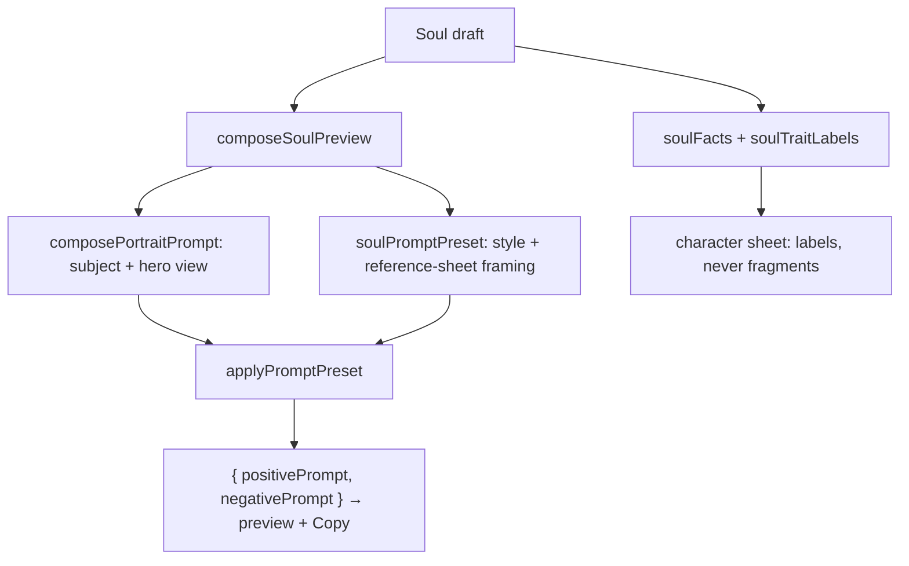

# soulPresentation.ts — AI component doc

> AI-facing sidecar for `soulPresentation.ts`. Created 2026-07-12. Keep this in sync with the code on every change.

## Purpose

Turns a `Soul` into the two things the UI must show: the prompt the MODEL will
see (the live composed preview) and the list of picked options a HUMAN reads on
the character sheet. Pure functions only — no i18n, no network, no React.

## What it does (for an AI reader)

- Responsibilities:
  - `composeSoulPreview(soul)` → the exact `{ positivePrompt, negativePrompt }`
    the server will submit for the HERO portrait, produced by the contract
    composers (`composePortraitPrompt` + `soulPromptPreset` + `applyPromptPreset`).
    The web never concatenates fragments itself (ADR §2).
  - `soulFacts(soul)` → `{ axis, value }[]` for the single-select axes the user
    actually picked, `value` being the contract table's LABEL (already Russian).
  - `soulTraitLabels(soul)` → the trait labels, sliced at `MAX_TRAITS` exactly as
    `composeSoul` slices them.
- Public API / exports: `composeSoulPreview`, `soulFacts`, `soulTraitLabels`,
  types `SoulAxis`, `SoulFact`.
- Inputs → Outputs: `Soul` → a `ComposedPrompt` / an array of facts / trait labels.
- Side effects: none.

## Dependencies

- Imports: `@opencreate/contracts` — the option tables (`ARCHETYPES`, `AGES`,
  `BUILDS`, `HAIR_COLORS`, `HAIR_STYLES`, `EYE_COLORS`, `SKINS`, `OUTFITS`,
  `VIBES`, `TRAITS`, `STYLE_PRESETS`), `MAX_TRAITS`, `PORTRAIT_SHEET_VIEWS`, and
  the composers `composePortraitPrompt` / `soulPromptPreset` / `applyPromptPreset`.
- Used by: `SoulConstructor` (live preview), `PromptLibrary` (the copyable text of
  each ready-made character), `SoulCard` / `SoulFacts` (the readable list).

## Diagram

## Key decisions / gotchas

- The preview is the HERO view (`PORTRAIT_SHEET_VIEWS[0]`), read from the contract
  array rather than written as `'front'`, so reordering the sheet there moves the
  preview here too.
- The style is NOT composed into the subject text by hand: it is a preset axis
  that owns a NEGATIVE prompt, and only `applyPromptPreset` carries both halves.
  Hand-composing it would smuggle in the positive and silently drop the negative.
- `soulFacts` prints LABELS (`Существо`), never fragments (`a fantasy creature,
  humanoid`). Those labels come from the contract tables and are already Russian —
  the documented exception to "every string goes through i18n"; only the AXIS name
  is localized, by the component, via `soul.field.*`.
- Unset axes are omitted entirely — a "Возраст: —" row would claim a choice the
  user never made.
- `soulTraitLabels` slices at `MAX_TRAITS` because `composeSoul` does: a card that
  listed a 7th trait would promise something the picture never contained.

## Commits

- _no commit yet_
