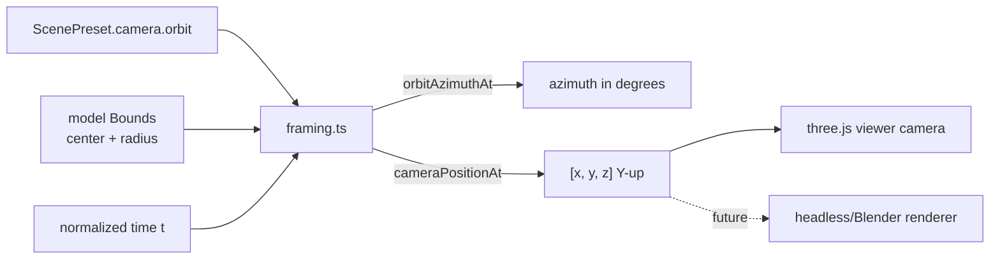

# framing.ts — AI component doc

> AI-facing sidecar for `framing.ts`. Created 2026-07-11. Keep this in sync with the code on every change.

## Purpose
Pure camera-framing math derived from a `ScenePreset`'s orbit definition. It answers
one question — "where does the camera sit at normalized time `t`?" — with no three.js
scene, no React, no DOM. That purity is deliberate (ADR D4, "one preset, N renderers"):
the exact same function must produce the camera path in the browser viewer today and,
later, in a headless/Blender renderer that renders the final downloadable video. If the
math lived inside a three.js component instead, the two renderers could silently drift
apart — a framing bug that's invisible in review and obvious in every single frame.

## What it does (for an AI reader)
- Responsibilities:
  - `orbitAzimuthAt(orbit, t)` — linear interpolation of azimuth (degrees) from
    `azimuthStartDeg` to `azimuthEndDeg` across `t ∈ [0,1]`. Deliberately unbounded and
    cyclic (never clamped to `[0, 360)`), because the `dramatic` preset sweeps
    `-30 -> 330` and a clamp would silently change which arc the camera travels.
  - `cameraPositionAt(orbit, bounds, t)` — full 3D camera position at time `t`, offset
    from the model's bounding-sphere `center` (not the world origin, since provider
    meshes are not reliably centred) at distance `bounds.radius * orbit.radiusFactor`
    (scale-invariant framing: a 2cm ring and a 3m sofa fill the same frame fraction).
- Public API / exports:
  - `type Bounds = { center: [number, number, number]; radius: number }`
  - `orbitAzimuthAt(orbit: Orbit, t: number): number`
  - `cameraPositionAt(orbit: Orbit, bounds: Bounds, t: number): [number, number, number]`
- Inputs → Outputs:
  - `Orbit` (from `ScenePreset['camera']['orbit']`: `azimuthStartDeg`, `azimuthEndDeg`,
    `elevationDeg`, `radiusFactor`) + a `Bounds` (model bounding sphere) + normalized
    time `t` → a Y-up `[x, y, z]` camera position, in the same units as `bounds`.
- Side effects: none. No I/O, no network, no mutable state — every call is a pure
  function of its arguments.

## Dependencies
- Imports: `ScenePreset` type only, from `@opencreate/contracts` (`packages/contracts/src/scene3d.ts`).
- Used by: the Studio3D turntable renderer/viewer (three.js scene, task 15) to drive the
  orbiting camera each frame/tick, and eventually any non-browser renderer that consumes
  the same `ScenePreset`. Does not import three.js or React, so it has no runtime
  coupling to either — a future non-browser renderer can call it directly.

## Diagram

## Key decisions / gotchas
- Y-up throughout, matching glTF/three (`preset.upAxis === 'Y'`). A future Blender
  exporter reads `upAxis` and rotates -90° about X itself; it does not get to
  reinterpret these numbers.
- Azimuth/elevation are converted from degrees to radians internally; callers always
  pass/receive degrees via the `ScenePreset` shape.
- At `t=0` with `azimuth=0`, the camera sits at `+Z` from the centre (three's default
  camera-forward convention) — verified by `framing.test.ts`.
- `boundsOf(object3D)` (a three.js `Box3`/`Sphere` helper to compute `Bounds` from a
  loaded scene) was intentionally NOT added here: it requires importing `three`, which
  would make this module impure in the sense that matters (coupled to a specific
  renderer's scene graph type), blocking a future non-three renderer from reusing it
  as-is. It belongs in a separate file next to the three.js loader (e.g. alongside
  `useGlb.ts`) when that task needs it.

## Commits
- `feat(web): pure camera framing math for scene presets` (see git log for hash)
