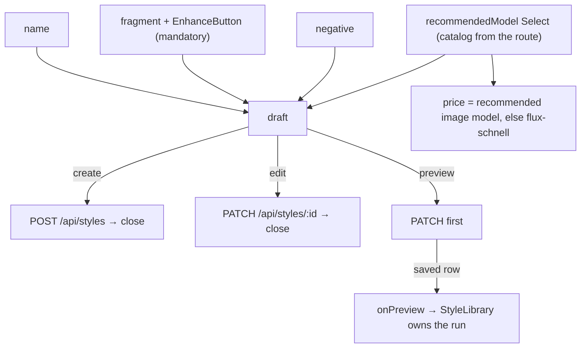

# StyleEditor.tsx — AI component doc

> AI-facing sidecar for `StyleEditor.tsx`. Created 2026-07-31. Keep this in sync with the code on every change.

## Purpose
The style CONSTRUCTOR: a modal holding the name, the positive fragment (with the
mandatory sparkle), the negative, an optional recommended model, and — once the
style exists — the priced preview button. Create and edit are the same component
because the fields are identical (the `EntityEditor` precedent).

## What it does (for an AI reader)
- Responsibilities: hold the draft; refuse a submit with no name or no fragment;
  POST on create / PATCH on edit; save-then-hand-up for the preview.
- Public API / props: `StyleEditor({ style: Style | null, models: CatalogModel[],
  isOpen, onClose, onPreview: (style: Style) => void, isPreviewPending })`.
  `style === null` is create mode. Endpoints reached through `../model/api`:
  `POST /api/styles`, `PATCH /api/styles/:id`.
- Inputs → Outputs: four form fields → a `CreateStyleInput` or `UpdateStyleInput`;
  the preview button → a PATCH followed by `onPreview(savedStyle)`.
- Side effects (I/O, network, state): `useCreateStyle` / `useUpdateStyle`
  mutations (both absorb into `['styles']`); the `EnhanceButton`'s own
  `POST /api/prompt/enhance`; four `useState` draft fields.

## Dependencies
- Imports / depends on: `react` (`useId`, `useState`), `react-i18next`, contract
  types (`Style`, `CatalogModel`), `shared/ui` (`Button`, `EnhanceButton`,
  `Input`, `Modal`, `Select`), `../model/api` (`PREVIEW_FALLBACK_MODEL_ID`,
  `useCreateStyle`, `useUpdateStyle`).
- Used by: `StyleLibrary.tsx`.

## Diagram

## Key decisions / gotchas
- **The preview is NOT run from here.** The button saves and hands the SAVED row
  upward; `StyleLibrary` owns the generation. A preview is a paid run that takes
  seconds to minutes and a user closes a modal — a poll that died with this
  component would leave a charged generation with nothing to attach it to.
- **Save FIRST, then preview.** The server resolves the style by id out of the
  database, so a preview run before the PATCH would render the fragment the
  server last heard about instead of the text on screen. The modal stays open so
  the result can be judged against the words that produced it.
- **Preview exists only in edit mode.** The run cites a style BY ID and a style
  still being typed has none (the same reason `EntityEditor` only attaches photos
  after the entity exists).
- **The sparkle's absolute placement lives on a WRAPPER div**, never on
  `EnhanceButton`'s own `className`: that class lands on the component's
  `relative` box, which is the anchor its error/nudge chip (`absolute
  bottom-full`) hangs from. Documented in `Canvas/components/ImageNode.tsx.md`
  and the `ShotInspector` precedent. The textarea gains `pr-12` so text never
  slides under the icon.
- **The fragment field uses `htmlFor` + `id`, not a wrapping `<label>`.** The
  sparkle sits inside the field's box, and a wrapping label would fold the
  button's own text into the textarea's accessible name.
- **The price is the model that will actually run it.** A recommendation naming a
  VIDEO model has no still price, so the label falls back to `flux-schnell` —
  exactly what `useStylePreview` will send. A number that did not match the charge
  would be worse than no number.
- **`recommendedModelId` is nullable on update but optional on create.** The
  create schema does not accept an explicit null, so the create path drops the key
  instead of sending one; the update path sends `null` because a picker must be
  able to CLEAR a recommendation, not only set one.

## Commits
- _no commit yet_

## Update 2026-07-31 — the package gains its reference strip
- Edit mode now renders `StyleReferenceImages` under the model `Select`; create
  mode renders the `styles.references.unsaved` line instead. Same rule as the
  preview button: a reference is attached to a style BY ID, and one still being
  typed has none.
- The strip reads `style.referenceImages` straight off the prop, which
  `StyleLibrary` now resolves from the LIVE cache by id — a captured row would
  leave the strip frozen at whatever it held when the modal opened.
- The editor is now KEYED by `editingId` upstream, which fixes a real bug from
  681698a: the draft lives in `useState`, so without a key the second style opened
  showed the first one's text. Keying on the ID (not the row) means a reference
  upload — which replaces the row — does NOT remount and wipe unsaved typing.
