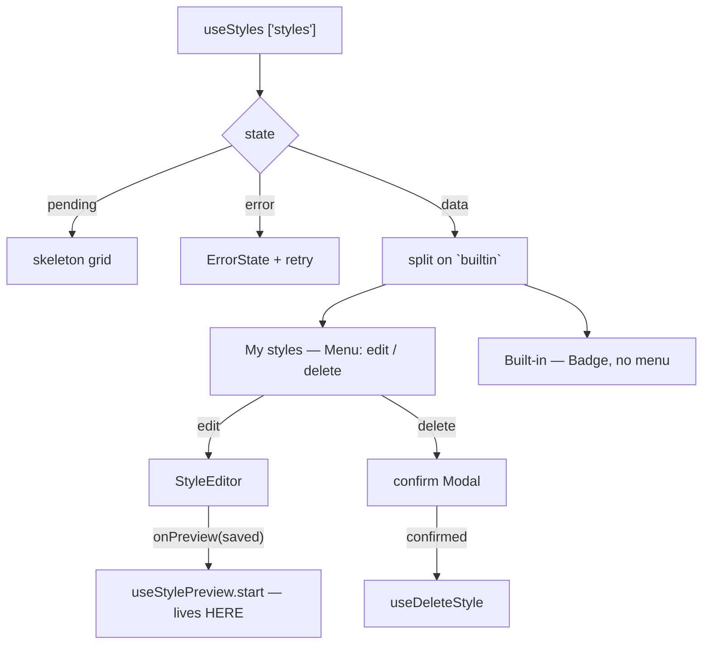

# StyleLibrary.tsx — AI component doc

> AI-facing sidecar for `StyleLibrary.tsx`. Created 2026-07-31. Keep this in sync with the code on every change.

## Purpose
The `/styles` page body: the 4-states registry (skeletons → error+retry → "none of
your own" → the grid), the constructor modal, the delete confirm, and the owner of
the preview RUN. The route owns the page canvas; this owns the library.

## What it does (for an AI reader)
- Responsibilities: read `['styles']` and split the one list into MINE and
  BUILTIN for display; open the editor in create or edit mode; gate deletion
  behind a confirm dialog; own the preview generation so it outlives the modal.
- Public API / props: `StyleLibrary({ models: CatalogModel[] })`. `models` is the
  catalog, injected from the route (this module must not import Generator) and
  passed straight to `StyleEditor`, which needs it to offer a recommended model
  and to price the preview button.
- Inputs → Outputs: the registry → two labelled grids of tiles; a tile's action
  menu → the editor or the delete confirm; the editor's `onPreview(savedStyle)`
  → a started preview run.
- Side effects (I/O, network, state): `useStyles` (GET), `useDeleteStyle`
  (DELETE), `useStylePreview` (POST /api/generations + poll + PATCH). Three
  pieces of local state: the style being edited, whether the editor is open, and
  the style awaiting delete confirmation.

## Dependencies
- Imports / depends on: `react` (`useState`), `react-i18next`, contract types
  (`Style`, `CatalogModel`), `shared/ui` (`Badge`, `Button`, `Card`, `EmptyState`,
  `ErrorState`, `Menu`, `Modal`, `Skeleton`), `../model/api`, `./StyleEditor`.
- Used by: `routes/_shell.styles.tsx` (through the module's `index.ts`).

## Diagram

## Key decisions / gotchas
- **The empty state is about OWNERSHIP, not emptiness.** The list is never
  literally empty — the builtins always arrive — so "no styles of your own" is
  scoped to the MINE section. A whole-page empty state would be a lie.
- **MINE leads, builtin follows.** The builtins are a reference shelf you read;
  the styles you wrote are what you came here to manage.
- **A builtin gets a badge and NO action menu at all**, not a disabled one: there
  is nothing a user may do to code that ships with the app, and the API refuses
  an update or delete on one with a 400. An affordance that always fails is worse
  than none.
- **The preview run is owned HERE, not in the editor.** It is a paid generation
  that takes seconds to minutes and users close modals; a poll owned by the modal
  would die on close and strand a charged run with nothing to attach it to and no
  way for the user to recover the credit. The editor saves and hands the saved
  row up through `onPreview`.
- **Deleting is confirmed** because the blast radius is invisible from this
  screen: the style vanishes from every picker in the app, and any film or shot
  already pointing at it asks for a style again at its next run. The pending row
  is held whole (not just its id) so a list refresh mid-dialog cannot swap which
  style is meant.
- **The tile is labelled by the name it displays** (`aria-labelledby` to a
  deterministic `style-name-<id>`, not `useId` — this runs inside a map), so the
  name is not repeated in an `aria-label` that could drift from the visible text.
- **The fragment is shown on the tile.** Reading a builtin's fragment is how a
  user learns to write a better one — the contracts file exposes them on purpose.

## Commits
- _no commit yet_

## Update 2026-07-31 — the edited style is resolved live, and the editor is keyed
- `editing` is no longer a captured `Style` in state; the component holds
  `editingId` and resolves the row from `data.items` every render. Attaching or
  removing a reference image rewrites that row in the `['styles']` cache, and a
  captured object would leave the editor's thumb strip frozen at its open-time
  contents. A style that vanished underneath us (deleted in another tab) resolves
  to null, so the editor opens in create mode rather than rendering a ghost.
- `StyleEditor` is now `key={editingId ?? 'new'}`. This fixes a bug shipped in
  681698a: the editor holds its fields in `useState` and is rendered permanently
  (the `Modal` returns null when closed but the component stays mounted), so the
  SECOND style opened showed the FIRST one's text. The Cinema inspector keys on
  `shot.id` for exactly this reason. Keying on the ID rather than the row means a
  reference upload does not remount the editor and discard unsaved typing.

## Update 2026-07-31 (b) — the tile shows the package
- A user style's tile now prints `styles.references.count` ("2 refs" / «2 реф.») in
  amber beside the fragment teaser when it carries reference images (team-lead
  request). A style is a PACKAGE of words AND pictures since ADR amendment A1, and
  without a count in the library that half is invisible until the constructor opens.
- Rendered ONLY when the count is > 0, so the builtin shelf — which can never carry
  references — is not littered with empty zeroes. The teaser line became a flex row
  so the count keeps its width (`shrink-0`) while the fragment truncates.
