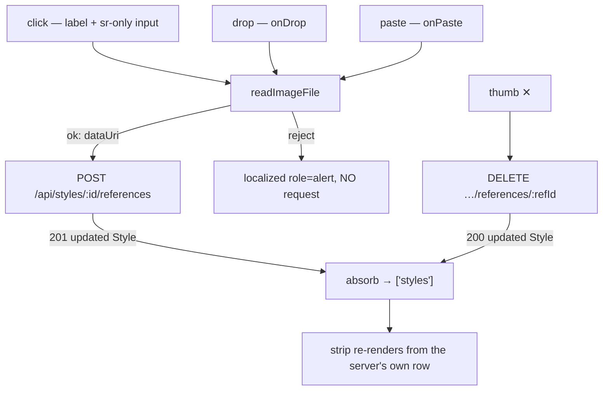

# StyleReferenceImages.tsx — AI component doc

> AI-facing sidecar for `StyleReferenceImages.tsx`. Created 2026-07-31. Keep this in sync with the code on every change.

## Purpose
The reference half of the style PACKAGE (ADR style-studio A1/A4): the thumb strip
inside the constructor that attaches up to three images to a style alongside its
prompt fragments. A near-mirror of Cinema's `ShotReferenceImages` — the two solve
the same problem and a user should not have to learn it twice.

## What it does (for an AI reader)
- Responsibilities: accept an image by click, drop or paste through the ONE shared
  gate; render the attached thumbs with a per-thumb remove; show the `N / 3`
  counter; state the ambience caveat; surface every refusal as localized copy.
- Public API / props: `StyleReferenceImages({ styleId: string, references:
  StyleReferenceImage[] })`. Endpoints, via `../model/api`:
  `POST /api/styles/:id/references { dataUri }` (201, the whole updated Style) and
  `DELETE /api/styles/:id/references/:refId` (200, the whole updated Style).
- Inputs → Outputs: a `File` from any of the three gestures → a data URI → the
  updated `Style` absorbed into `['styles']`; a thumb's ✕ → the same, minus one.
- Side effects (I/O, network, state): the two mutations above; `readImageFile`
  reads the file client-side; two `useState` (the local reject key, the drag ring).

## Dependencies
- Imports / depends on: `react`, `react-i18next`, `@opencreate/contracts`
  (`StyleReferenceImage`, `STYLE_MAX_REFERENCES`), `shared/libs/apiClient`
  (`ApiClientError`), `shared/libs/errorCopy` (`errorCodeMessageKey`),
  `shared/libs/readImageFile`, `shared/ui` (`Card`, `Skeleton`),
  `../model/api` (`useAddStyleReference`, `useDeleteStyleReference`).
- Used by: `StyleEditor.tsx` (edit mode only).

## Diagram

## Key decisions / gotchas
- **Three gestures, ONE gate.** Click, drop and paste all funnel through
  `shared/libs/readImageFile`, so the type/size rules cannot fork between them or
  drift from the wire's 14MB base64 cap. A reject is a localized notice and NO
  request — a wrong file costs a round-trip to nobody.
- **The copy is honest about AMBIENCE, and that is load-bearing.** The server
  applies these through the same reference channel as entity photos and shot
  references, WITH the model's gates: on a model with no reference support they are
  dropped silently, and when the budget is full the STYLE's images are trimmed
  FIRST (ADR A2/A3 — entity tags outrank a style). So the line reads "applied where
  the model can use them"; copy promising they always reach the model would be a
  lie, and a test pins the wording.
- **At the cap the add tile is GONE, not disabled.** The server refuses a fourth
  with a 400, and an affordance that always fails is worse than none. The counter
  turns amber at the cap so the number reads as the reason rather than a glitch.
- **Both writes answer with the WHOLE Style**, so this component never merges a
  partial result — it re-renders from the server's own row. That is also why
  `StyleLibrary` resolves the edited style from the live list by id instead of
  holding a captured object: a captured row would freeze this strip.
- **A delete of an unknown refId is a 200 no-op server-side**, not a 404, so an
  optimistic/racing delete is safe to fire and safe to absorb.
- **Testing note:** `<input accept="image/*">` filters a non-image before it is
  ever read, so the honest reject vector in a test is a DROP, not `userEvent.upload`
  (the same reasoning `ShotReferenceImages.test.tsx` records).

## Commits
- _no commit yet_
